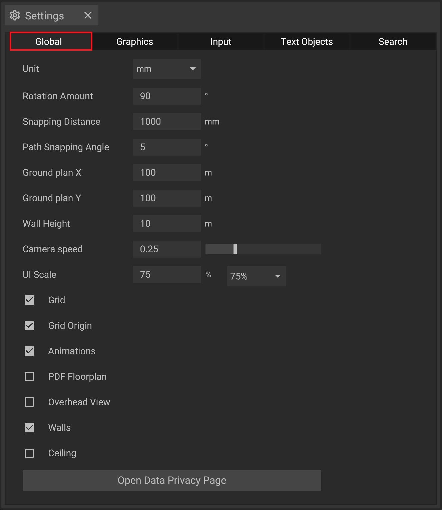

# Global Settings

The global settings offer different options to adjust the [user interface](../user-interface/) and the [floor plan](../user-interface/the-floor-plan.md). They can be tweaked by using the [settings panel](../user-interface/settings-panel.md).

## The options explained:

| Input Fields            | Description                                                                                                                                                                 |
| ----------------------- | --------------------------------------------------------------------------------------------------------------------------------------------------------------------------- | 
| **Unit**                | This defines the measurement unit of your project file (e.g. mm, m, ft) and will be shown in the [mouse coordinates](../user-interface/coordinate-system#mouse-coordinates) | 
| **Rotation Amount**     | The amount of degrees an object is rotated when you press the  rotate buttons in the [2D top bar](../user-interface/the-2d-panel.md#the-toolbar-of-the-2d-panel)                                                                              | 
| **Snapping Distance**   | The distance an object is moved every step, when using the [grid](../user-interface/the-grid.md)                                                                            |
| **Path Snapping Angle** | The amount of degrees changes in an angle will be snapped to using the [path tool](../advanced-tools/path-tool.md)                                                          |
| **Ground Plan X**       | The size of the Ground Plan in direction forward/backward                                                                                                                   |
| **Ground Plan Y**       | The size of the ground plan in direction left/right                                                                                                                         |
| **Wall Height**         | The height of the walls surrounding the ground plan                                                                                                                         |
| **Camera Speed**        | The speed of the camera [when moving](../getting-started/moving-the-camera.md) it in the [3d view](../user-interface/the-3d-panel.md)                                       |
| **UI Scale**            | The size of the panels of your [layout](../user-interface/layouts.md) in iVP Planning                                                                                       |

| Toggle            | Description                                                                                                             |
| ----------------- | ----------------------------------------------------------------------------------------------------------------------- | 
| **Grid**          | Toggles the visibility of the [grid](../user-interface/the-grid.md) in the [2D view](../user-interface/the-2d-panel.md) |
| **Grid Origin**   | Toggles the visibility of the [grid rigin marker](../user-interface/the-grid.md#grid-origin)                            |
| **Animations**    | Toggles all animations globally without changing the animation settings of the individual objects                       |
| **PDF Floorplan** | Toggles the visibility of a [imported PDF](../user-interface/the-floor-plan.md#pdfs-as-floor-plan)                      |
| **Overhead View** | Toggles animations to be shown in the [2D view](../user-interface/the-2d-panel.md) (impacts performance heavily)        |
| **Walls**         | Toggles the visibility of the walls surrounding the ground plan                                                         |
| **Ceiling**       | Toggles the visibility of the ceiling spanning the ground plan (visible only from below its height)                     |

* Open Data Privacy Page: Opens the [Data Privacy Page](https://dataoptout-ui-prd.uca.cloud.unity3d.com/?token=8t3ubddchq35f7pv4ffmng2fapmc7dpe58sn20part1hclip) containing all information about data usage and used 3rd party sharing. 