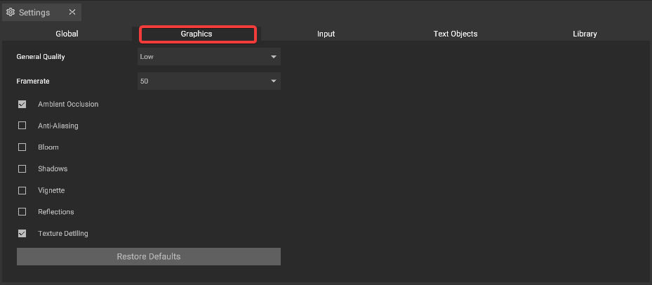

# Graphic Settings

To get started we recommend you to have a look at this iVP YouTube Tutorial to learn more about the different options and their effects.


Graphic settings in iVP Planning (german)


The graphic settings offer several options to adjust the graphic quality and various visual aspects. They can be adjusted by using the [settings panel](../user-interface/settings-panel.md).

## Settings

## General Quality

The __General Quality__ option lets you quickly choose between the presets __Low__, __Medium__ or __High__ from a dropdown list to have an overall influence on the graphical quality and performance.


__Laptops__ or __tablets__ should usually be used with the General Quality __Low__ and none of the graphic options below to prevent performance issues. The General Quality __High__ is only recommended for high-end computers with dedicated graphic cards.


## Framerate

The __Framerate__ option gives you a dropdown list to set the maximum frame rate of iVP Planning. You can choose between __25__, __30__, __50__, __60__, __90__ or __unlimited__ frames per second. The higher the frame rate the visually smoother the experience.

## Ambient Occlusion

The __Ambient Occlusion__ option lets you toggle this effect that influences the realism of the ambient lighting and its interaction with surfaces.

## Anti-Aliasing

The __Anti-Aliasing__ option smoothens the edges of objects for a visually more appealing look.

## Bloom

The __Bloom__ option toggles the simulation of a bloom effect for extremely bright light sources.

## Shadows

The __Shadows__ option lets you switch object shadows on or off.

## Vignette

The __Vignette__ option adds a soft decrease of brightness in the corners of your view to simulate an effect known from photographic lenses.

## Reflections

The __Reflections__ toggles the simulation of light reflections on the surfaces of objects.

## Texture Detiling
