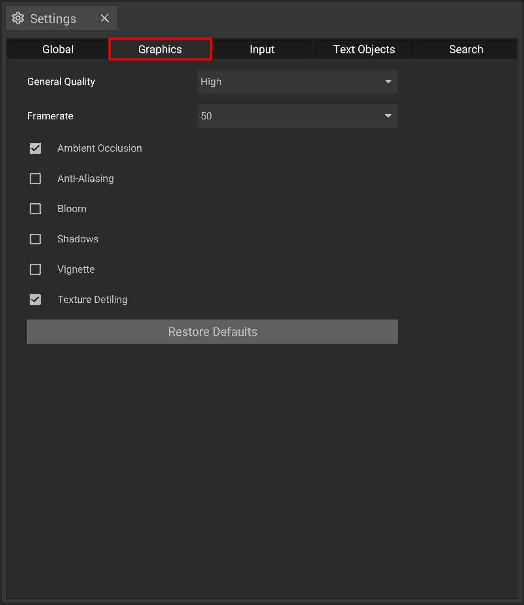

# Graphic Settings

The graphic settings offer several options to adjust the graphic quality and different visual aspects. They can be tweaked by using the [settings panel](../user-interface/settings-panel.md).


**Laptops or tablets** should usually be used with the **General Quality "Low"** and none of the graphic options below to prevent performance issues. The **General Quality "High"** is only recommended for **high-end computers** with newer graphic cards.


## The options explained

| Dropdown              | Description                                                                 |
| --------------------- | --------------------------------------------------------------------------- | 
| **General Quality**   | Overall graphical quality based on presets                                  |
| **Frame Rate**        | Maximal frame rate                                                          |

| Toggle                | Description                                                                 |
| --------------------- | --------------------------------------------------------------------------- | 
| **Ambient Occlusion** | Toggles ambient occlusion                                                   |
| **Anti-Aliasing**     | Toggles anti-aliasing                                                       |
| **Bloom**             | Toggles bloom                                                               |
| **Shadows**           | Turns shadows on and off                                                    |
| **Vignette**          | Adds a vignette effect to the [3D-panel](../user-interface/the-3d-panel.md) |
| **Texture Detiling**  | Reduces visible patterns that occur when using textures on large areas      |

* **Restore Defaults**: Set graphic settings back to default parameters