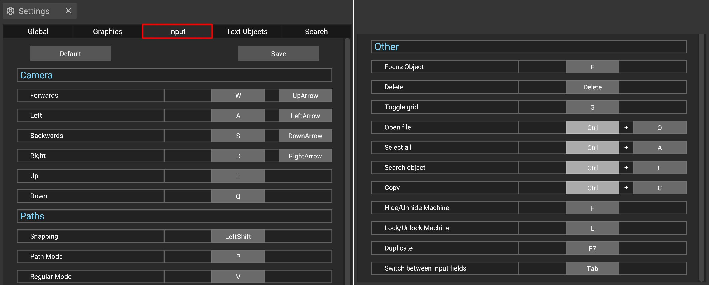

# Input Manager

The input manager makes it possible to change many of the [keyboard shortcuts](../keyboard-shortcuts.md) used in iVP. You can open the input manager via the [settings panel](../user-interface/settings-panel.md).

## Changing and saving shortcuts

To change a shortcut, simply click on the gray button on the right side of the respective entry, followed by the key you want to use as new shortcut.

To save a custom layout of shortcuts globally, press the "save" button and your changes will be also available when you start iVP the next time.


Some functions can have multiple shortcuts assigned, e.g. the forward movement of the camera. Other functions need two keys to be pressed at the same time, symbolized by a + inbetween the two keys (e.g. "Search object").
