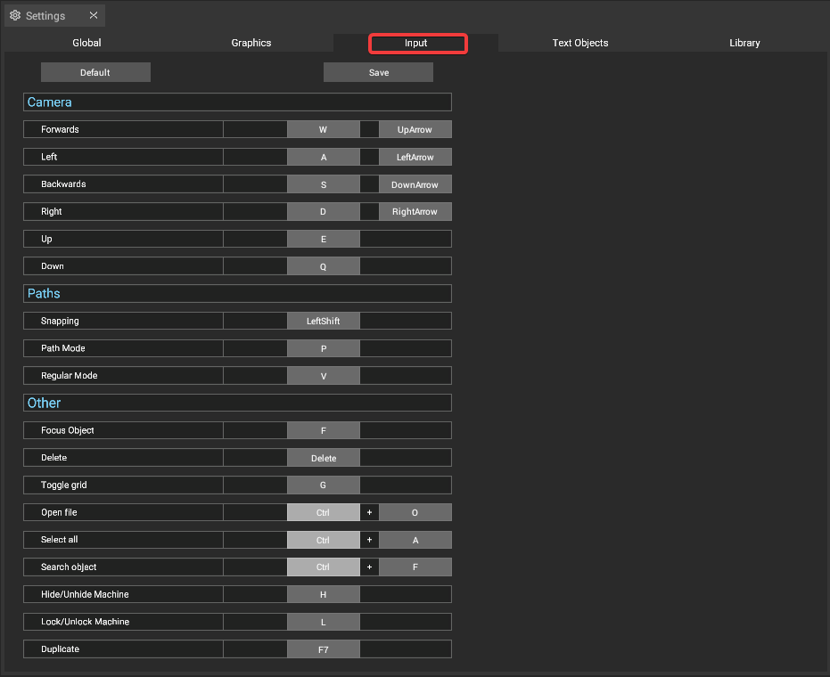
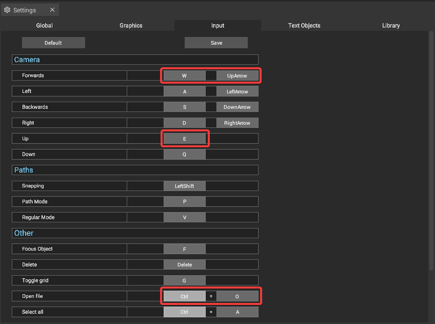
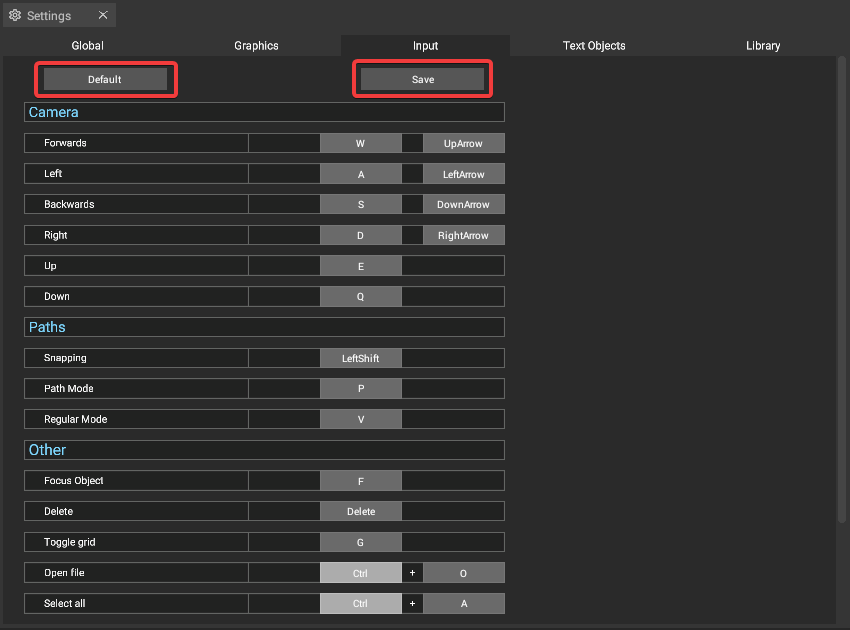

# Input

The Input settings allows you to change many of the [keyboard shortcuts](../keyboard-shortcuts.md) used in iVP Planning. You can open it via the [settings panel](../user-interface/settings-panel.md).

## Changing shortcuts

To change a shortcut simply click on the gray button on the right side of the respective entry, followed by pressing the key you want to use as new shortcut.


Some functions can have multiple shortcuts assigned, e.g. the forward movement of the camera. Other functions need two keys to be pressed at the same time, e.g. _Search object_.


* **Deafult**: Resets the [keyboard shortcuts](../keyboard-shortcuts.md) to the default settings.
* **Save**: Stores the [keyboard shortcuts](../keyboard-shortcuts.md).