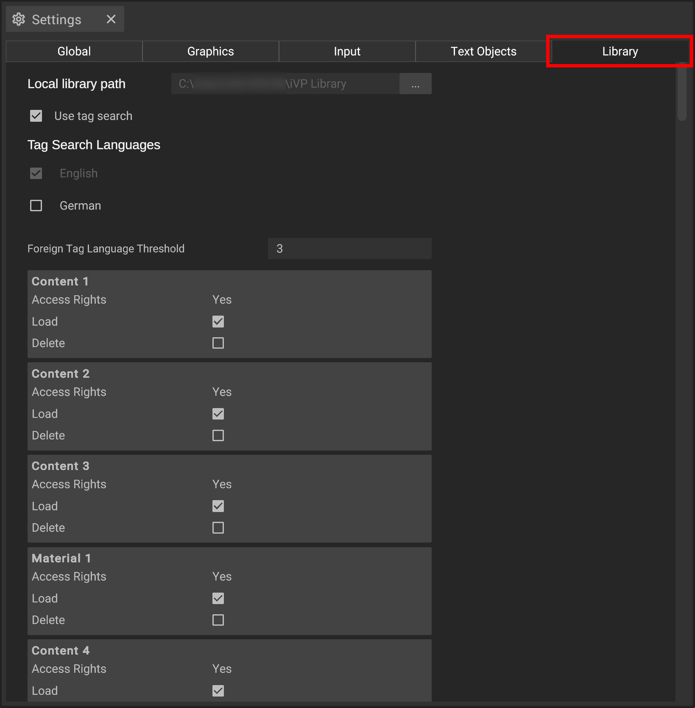

# Library settings

The Library settings allow you to change the basic properties and behaviour of your library. You can open it via the [settings panel](../user-interface/settings-panel.md).

## Settings

__Local library path__ sets the path to your local asset library.

__Use tag search__ toggles the tag search.

__Tag Search Languages__ lets you toggle the languages to include into your tag search.


The currently set display language can not be excluded from the tag search.


__Foreign Tag Language Threshold__ lets you define a minimum amount of search results below which the tags of foreign languages are also included into your serch.

### Asset Databases

You can also find a list of all externally accessible asset databases you have access to showing you their __Name__, __Access Rights__ and two toggles for __Load__ and __Delete__.

__Load__ toogles the initial loading of the assets during opening the software.

__Delete__ removes the local copy of the assets from your system.