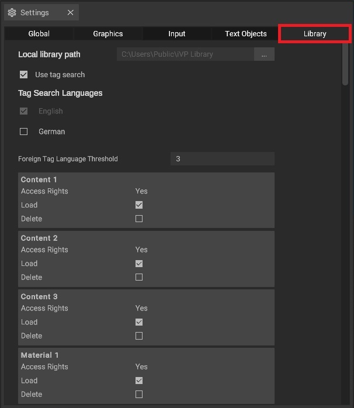

# Library

The library settings enable you to locate and modify your local library path. Additionally, they also grant you the choice to selectively load or exclude assets into the program.

The library settings can be opened via the [settings panel](../user-interface/settings-panel.md).

## The options explained

* Use Tag Search: Allows you to locate assets based on their assigned tags or keywords
* Tag Search Languages: Tag search languages enable searching for tags or keywords across one or multiple languages simultaneously