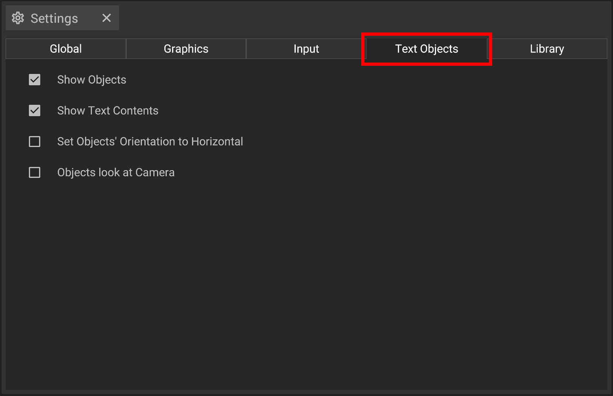

# Text objects settings

The Text Objects settings allow you to change the basic properties and behaviour of Text Objects. You can open it via the [settings panel](../user-interface/settings-panel.md).

## Settings

__Show Objects__ toggles the visibility of the 3D Text Object.

__Show Text Contents__ toggles the visibility of the Text Objects' label.

__Set Objects' Orientation to Horizontal__ toggles between a 2D or 3D Text Object.

__Objects look at Camera__ toggles the label of the Text Object to face the camera.