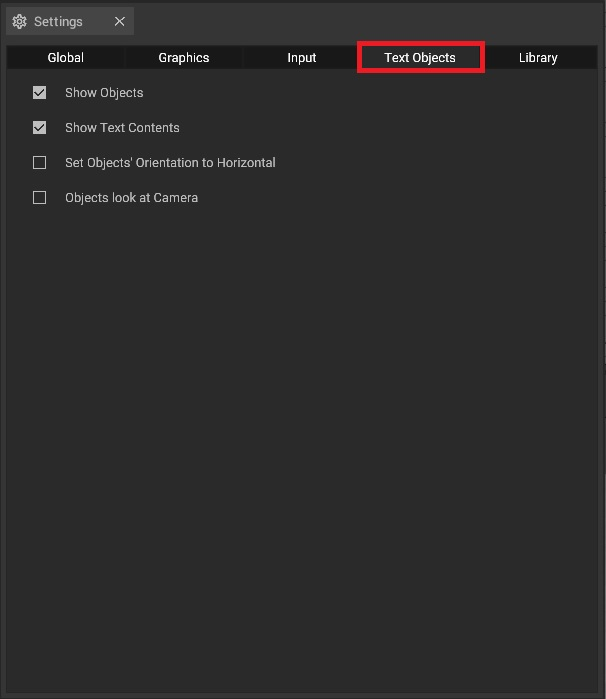

# Text Objects

The text object settings offer several options to adjust the behaviour of the Text Object from the library.

## The options explained:

* Show Objects: Toggles object visibility
* Show Text Contents: Toggles text visibility
* Set Objects Orientation to Horizontal: Converts text objects for 2D display within the 3D-View.
* Object looks at Camera: The text will always face in the direction of the camera in the 3D-View