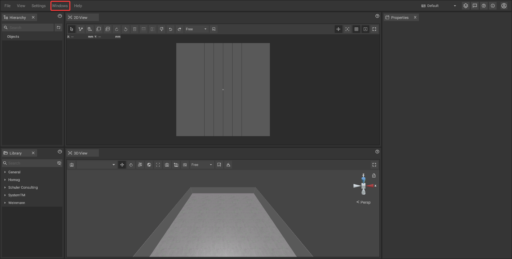
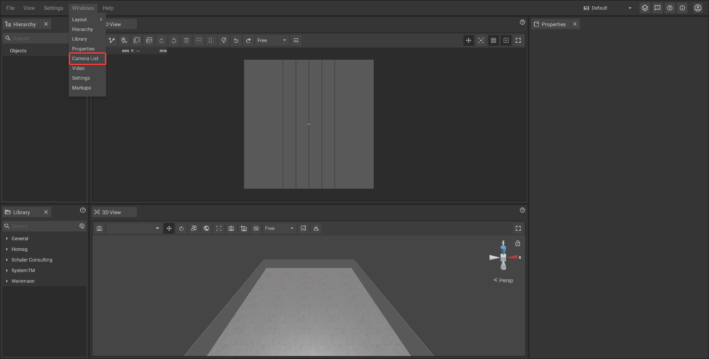

# Camera List Panel

The camera list panel is used to manage the [virtual cameras](../advanced-tools/virtual-cameras.md) used to [record videos in iVP](../advanced-tools/virtual-cameras.md#setting-up-virtual-dolly-shots).

## Opening the panel step by step:

The settings panel can be opened by either clicking on **Windows -> Camera List ** on the **top bar**.

