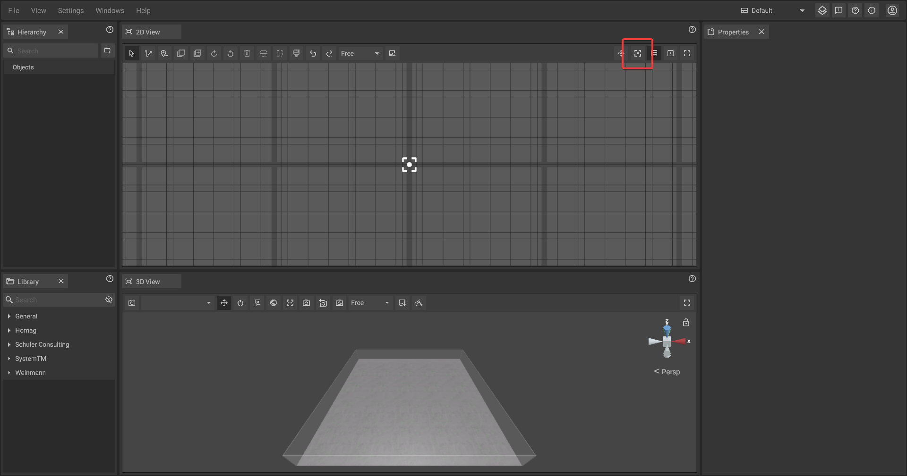
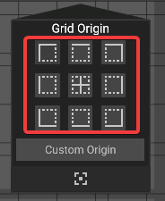
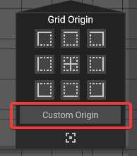
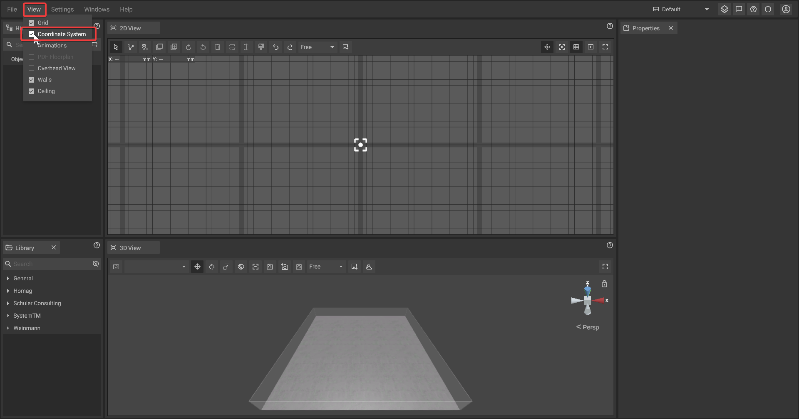
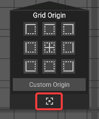
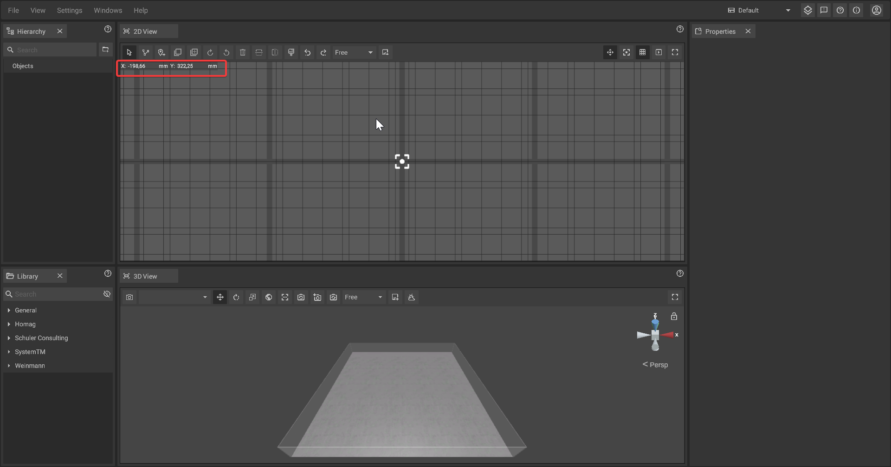

# Coordinate System

The three dimensional coordinate system in iVP is the foundation of all object [positions](../machines/move-objects.md). Originating from an adjustable reference / zero point, it describes where all objects in a project are located. In the 2D-panel, the reference point is represented by a white cross hair.


The reference point is also the origin of the [grid](the-grid.md).






## Adjusting the reference point:

The reference point can be changed through a menu which can be opened by clicking on the corresponding icon in the [toolbar of the 2D-panel](the-2d-panel.md#the-toolbar-of-the-2d-panel).

By clicking one of the buttons the reference point can be moved according to a predefined point like the corners or the center of the [floor plan](the-floor-plan.md).

It is also possible to define a custom reference point by clicking on "Custom Origin". The mouse cursor will turn into a cross hair and the next left click will set the new reference point.

## Reference point visibility:

The visibility of the reference point can be toggled by either clicking on **View -> Coordinate System**.&#x20;

Alternatively, the visibility of the reference point can also be toggled via the menu that can be opened via the click on an icon in the [2D-panel toolbar](the-2d-panel.md#the-toolbar-of-the-2d-panel).

In the menu, the corresponding button can be found at the bottom.

## Mouse coordinates:

The current x/y-position of the mouse pointer is displayed at the edge of the 2D-panel.

The mouse coordinates can be toggled by clicking on the "Mouse Coordinates" icon in the [2D-panel toolbar](the-2d-panel.md#the-toolbar-of-the-2d-panel).

