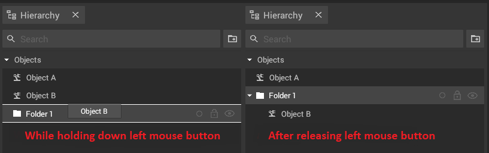
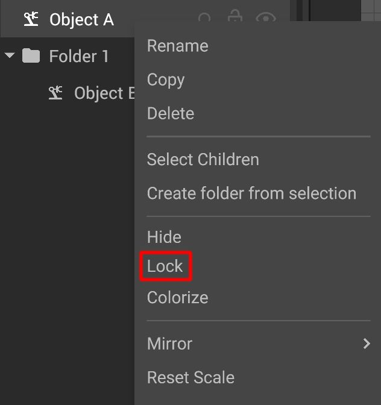
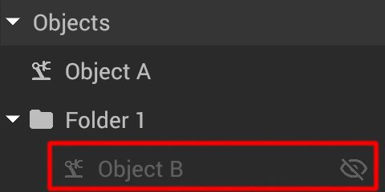

# Hierarchy Panel

Every object that is added to a project will get an associated entry in the hierarchy panel during its creation. This panel contains a list of all objects and is used to organize them in a tree structure. 

Via this panel it is possible to collect objects in [folders](#folders), to [rename](../machines/renaming-objects-and-folders.md) objects and folders, to toggle their [visibility](#hideunhide-objects) or to lock them to prevent unwanted changes.

## The elements of the panel:

|                                                           |                                                                                                                                                   |
| --------------------------------------------------------- | ------------------------------------------------------------------------------------------------------------------------------------------------- |
|         | The search bar makes it possible to only display machines or objects which names contain the entered text (the search is not case sensitive) |
|  | Adds a new folder to the hierarchy                                                                                                                |
|          | Visualisation of the [color](../machines/highlighting-objects.md) set for the object(s)                                                           |
|           | Locks or unlocks the currently selected object(s)                                                                                                 |
|     | Toggles the visibility of the currently selected object(s)                                                                                        |

## Folders

Folders can be used to structure projects. They can only be accessed in the hierarchy panel, however locking or hiding them will affect all objects inside - also in the [2D- ](../user-interface/the-2d-panel.md)and [3D-panel](../user-interface/the-3d-panel.md).

### Creating folders:

To create a folder, **press the "new folder" button** in the top of the hierarchy panel and a new folder will be added.


The new folder will be placed at the topmost position of the hierarchy. It can then be sorted into/under other folders or objects. 


### Moving objects in the hierarchy panel:

Objects can be [moved](../machines/select-objects.md#selecting-objects-via-the-hierarchy) in the hierarchy via drag and drop. A white frame will indicate where the object will go. Drop an object onto another one, to group it together with the target.

## Lock/Unlock objects

To prevent objects from being [selected](../machines/select-objects.md#selecting-objects-in-the-2d--and-3d-panel) and [moved](../machines/move-objects.md) in the [2D View](the-2d-panel.md) and [3D View](the-3d-panel.md)  press the  **Lock/Unlock Machine** button.

Alternatively **right click** a selected object to open the context menu and lock the selected object(s).

## Hide/unhide objects

To hide or show one or more objects, [select](../machines/select-objects.md#selecting-objects-via-the-hierarchy) them and press the  **Hide/Unhide Machine** button.

Alternatively you can right click a selected object and use the context menu to change the visibility of any selected object.

A hidden object will not be shown in the [2D view](the-2d-panel.md) and [3D view](the-3d-panel.md). It will still be shown in the hierarchy panel and turn to a darker grey color. It will still be editable in the properties panel. 


A hidden object can **not be moved** in the [2D view](the-2d-panel.md) and [3D view](the-3d-panel.md)! 
