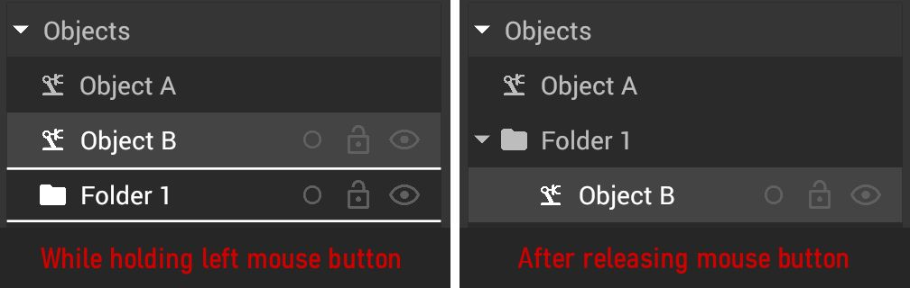

# Hierarchy Panel

Every object that is added to an iVP project will get an associated entry in the hierarchy panel during its creation. This panel contains a list of all machines, objects, [DXF imports](../advanced-tools/dxf-tool.md), [markups](../advanced-tools/markup-tool.md), images, [PDF imports](../getting-started/importing-pdfs.md) and [virtual cameras](../advanced-tools/virtual-cameras.md) and is used to organize them in a tree structure. 

Via this panel it is possible to collect objects in [folders](#folders), to [rename](../machines/renaming-objects-and-folders.md) objects and folders, to toggle their [visibility](#visibility) or to lock them to prevent unwanted changes.

## The elements of the panel:

|                                                           |                                                                                                                                                   |
| --------------------------------------------------------- | ------------------------------------------------------------------------------------------------------------------------------------------------- |
|         | The search bar makes it possible to only display such machines or objects which names contain the entered text (the search is not case sensitive) |
|  | Adds a new folder to the tree view                                                                                                                |
|          | Visualisation of the [color](../machines/highlighting-objects.md) set for the object(s)                                                           |
|           | Locks or unlocks the currently selected object(s)                                                                                                 |
|     | Toggles the visibility of the currently selected object(s)                                                                                        |

## Folders

Folders can be used to structure projects. They can only be accessed in the hierarchy panel, however locking or hiding them will affect all objects inside - also in the [2D- ](../user-interface/the-2d-panel.md)and [3D-panel](../user-interface/the-3d-panel.md).

### Creating folders:

To create a folder, press the "new folder" button in the top of the hierarchy panel and a new folder will be added.


The position of the new folder in will be in the topmost layer of the hierarchy. It can then be sorted into/under other folders or objects. 


### Moving objects in the hierarchy panel:

To move objects or other object in the hierarchy, select their entries in the hierarchy panel and drag them on the folder/object name. A white frame will indicate where the entries will be moved to and they will be sorted into other folders or objects if applicable.

## Lock/unlock objects

To prevent most [object interactions](../machines/README.md) for one or more objects, [select](../machines/selecting-and-moving-objects.md#selecting-objects-via-the-machine-list-panel) them and press the  **Lock/Unlock Machine** button.

Alternatively you can use the context menu to lock any selected object.

A locked object only be locked in the [2D view](the-2d-panel.md) and [3D view](the-3d-panel.md)

## Hide/unhide objects

To hide or show one or more objects, [select](../machines/selecting-and-moving-objects.md#selecting-objects-via-the-machine-list-panel) them and press the  **Hide/Unhide Machine** button.

Alternatively you can use the context menu to change the visibility of any selected object.

A hidden object will not be shown in the [2D view](the-2d-panel.md) and [3D view](the-3d-panel.md). It will still be shown in the hierarchy panel and turn to a darker grey color and can still be moved in the hierarchy. 


A hidden object can **not be moved** in the [2D view](the-2d-panel.md) and [3D view](the-3d-panel.md)! 
