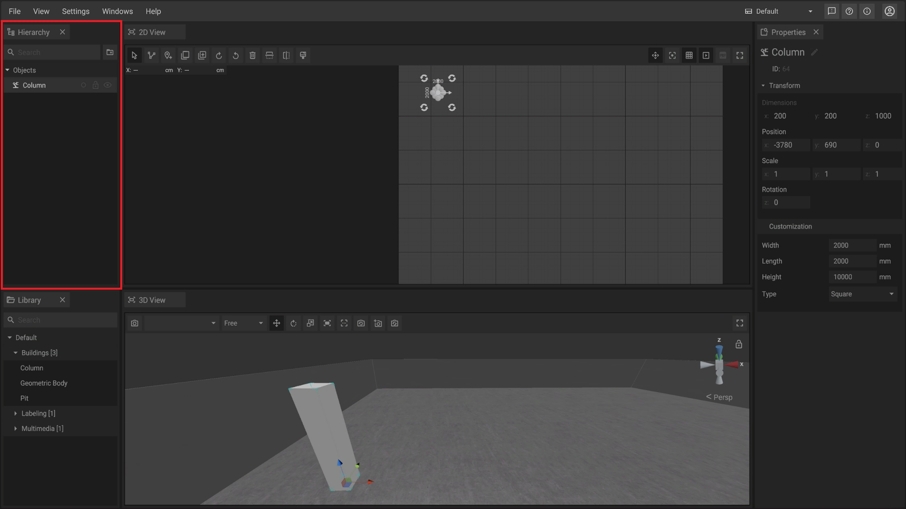
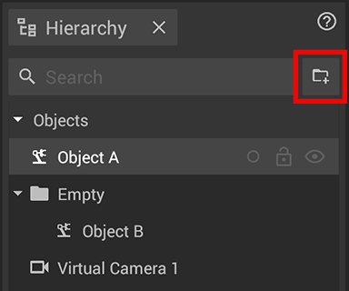
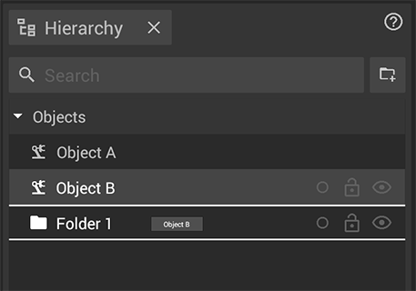
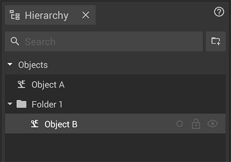
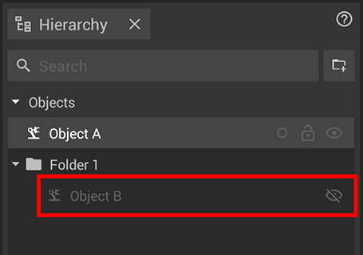
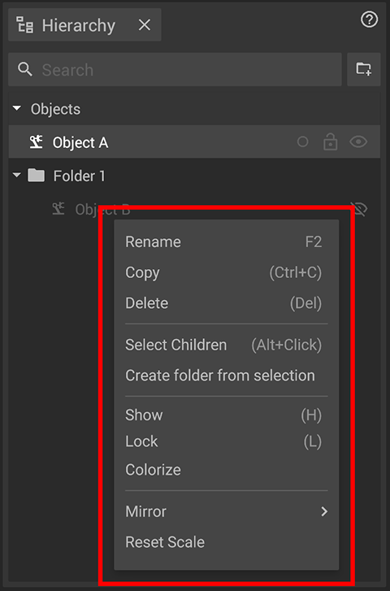

Every object that is added to a project will get an associated entry in the hierarchy panel during its creation. It is possible to collect objects in [folders](#folders), to [rename](../machines/renaming-objects-and-folders.md) objects and folders, to toggle their [visibility](#hide-unhide-objects) or to [lock](#lock-unlock-objects) them to prevent unwanted changes.

## The elements of the panel

|     |     |
| --- | --- |
|  | The __Search Bar__ makes it possible to filter machines or objects inside the hierarchy by name. The search is not case sensitive. |
|  | __New Folder__ adds a new folder to the hierarchy. |
|  | __Color__ provides you an indicator of the [color](../machines/highlighting-objects.md) set for the object(s) via the [Colorize](../machines/highlighting-objects.md) tool of the 2D View. |
|  | __Lock/Unlock Machine__ lets you lock or unlock the currently selected object(s) for editing. |
|  | __Hide/Unhide Machine__ toggles the visibility of the currently selected object(s) in the 2D View and 3D View. |

## Folders

Folders can be used to optimize the structure of your project by grouping the objects you placed inside. They will be treated as a single parent object that can be colorized, locked or hidden as well. Locking and Hiding them will also affect all children objects inside - in the [2D View](../user-interface/the-2d-panel.md) and in the [3D View](../user-interface/the-3d-view.md).


Folders can only be accessed in the hierarchy panel.


### Creating folders

To create a folder click on the  __New Folder__ button in the top right corner of the hierarchy panel. A new folder will be added to your hierarchy.


The new folder will be placed at the bottom position of the current hierarchy. It can then be sorted into/under other folders or objects. 


## Moving objects in the hierarchy panel

Objects can be [moved](../machines/select-objects.md#selecting-objects-via-the-hierarchy) in the hierarchy via drag and drop. A white frame will indicate where the object will be placed. Drop an object onto another one to group it together with the target.

| __Drag__ | __Drop__ |
| --- | --- |
|  |  |

## Lock/Unlock objects

To prevent objects from being [selected](../machines/select-objects.md#selecting-objects-in-the-2d--and-3d-panel) and [moved](../machines/move-objects.md) in the [2D View](the-2d-panel.md) and [3D View](the-3d-view.md) press the  **Lock/Unlock Machine** button.

## Hide/unhide objects

To hide or show one or more objects [select](../machines/select-objects.md#selecting-objects-via-the-hierarchy) them and press the  **Hide/Unhide Machine** button.

A hidden object will not be shown in the [2D View](the-2d-panel.md) and [3D View](the-3d-view.md). It will still be shown in the Hierarchy Panel with a darker grey color and the  icon. You can still edit it in the [Properties Panel](./the-properties-panel.md).


You can __not__ [__move__](../machines/move-objects.md) or [__rotate__](../machines/rotate-objects.md) a hidden object in the [2D View](the-2d-panel.md) and [3D View](the-3d-view.md).


## Context Menu

You can open a context menu for any object with a __Right Click__ on it inside the Hierarchy Panel.
Next to the already mentioned options to [colorize](#the-elements-of-the-panel), [lock](#lock-unlock-objects) and [hide](#hide-unhide-objects) there are additional features available for you.

__Rename__ allows you to edit the name of the object.

__Copy__ lets you copy the object (without its children).

__Delete__ will remove the currently selected object(s).

__Select Children__ allows you to select the object and its children.

__Create folder from selection__ will create a new folder with the currently selected objects inside of it.

__Mirror__ allows you to mirror the currently selected object(s) horizontally or vertically.

__Reset Scale__ will set the [scale](../machines/scale-objects.md) value of the currently selected object(s) to its default values (usually 1 on all axes).