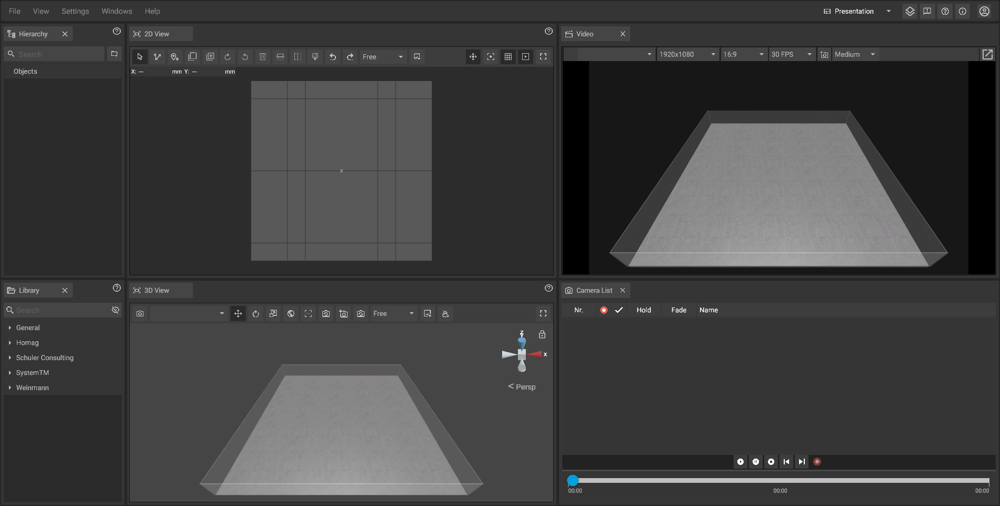

# Layouts

To quickly adjust iVPs user interface to your needs (e.g. [video production](../advanced-tools/virtual-cameras.md)) you can choose from a number of presets that will automatically adjust the [window layout](adjusting-the-ui.md).

## Switching between layouts step by step:

To switch to another layout simply click on the layout button on the [top bar](the-top-bar.md) at the top of the screen and then click on one of the layout names.


The text on the layout button will change depending on the currently active layout. By default it will look like this: .


## Currently available layouts:




The default layout displays all the panels necessary for planning and quick [measurements](../advanced-tools/path-tool.md#measurements).




The presentation layout replaces the info panel through the [virtual camera panel](virtual-camera-panel.md) and the [camera list panel](camera-list-panel.md) and widens the [2D-](the-2d-view.md) and the [3D View](the-3d-view.md) so that everything is set up for the production of [screenshots ](../advanced-tools/creating-screenshots.md)and [virtual dolly shots](../advanced-tools/virtual-cameras.md).




The simple layout is useful to display information of already existing objects and features wider [machine](the-machine-list.md) and [library panels](library-panel.md) and a large [info panel](the-info-panel.md).




The 2D layout focuses entirely on the [2D View](the-2d-view.md), providing a streamlined interface for planning tasks. In the top-left corner,  it can be switched to the [3D View](the-3d-view.md) to access spatial views and further planning capabilities.
 



The 3D layout centers around the [3D View](the-3d-view.md), offering a spatial overview for advanced planning tasks. In the top-left corner, it can be switched to the [2D View](the-2d-view.md) to focus on floor plans or schematic views.



## Custom layouts:

Custom layouts are defined by the user and can be saved for later use.


This feature is currently in development and will be added to iVP in the near future.

