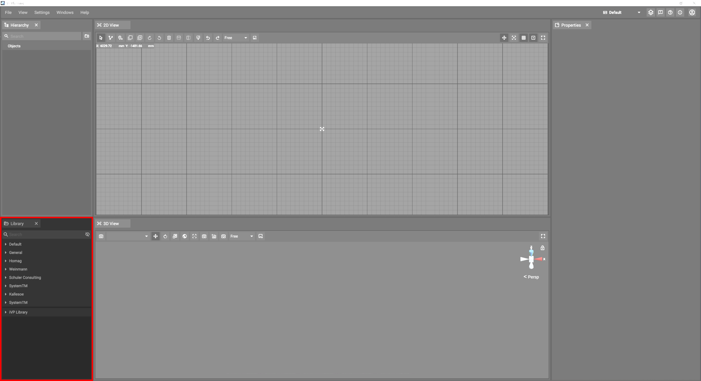

# Library Panel

Planning has access to a diverse catalogue of pre-build objects. These objects can be [placed](../machines/first-steps-with-3d-object.md) in your plan from the library panel.

## Tree Structure

The objects in the library are organized in a tree structure:

|          |             |
|----------|-------------|
|  | Categories have a light gray background. With the exception of the top most categories, they show the number of subelements (subcategories and objects) in brackets. Clicking a category expands it. |
|    | Objects have a dark gray background. Clicking an object displays a 3D preview of the object. Clicking in the [2D-](the-2d-panel.md) or [3D-panel](the-3d-panel.md) afterwards places the object at the respective position. |

## Search

You can filter the library using the search field at the top.

When you enter a search term the library only displays objects that include your search term in their name in your currently selected language. The search is case insensitive.

### Tags

The library might also suggest tags when your search term matches an existing tag. These can be used to further filter your results. Tags and the search term filter additively, meaning you will only see objects that match your search term and have all selected tags assigned.

### Unloaded Objects

The eye icon on the right side of the search bar let's you choose whether you want to include objects that have not been loaded in the search results. Unloaded objects might be objects that you do not have access permissions for or objects that you excluded from being loaded or deleted in the library tab of the settings panel. You can not place object's that have not been loaded. This setting can help you troubleshoot when you can't find the object you're looking for.

## Updates

The objects in your library will be updated from time to time. If an update of a bundle (a collection of objects) you're using is available, it will automatically be downloaded on application start. You will see the progres of the updates at the bottom of the library.

Planning can be used in the meanwhile, but the objects from the bundles that are currently being updated will not be available until the download has finished.

## Local Library

You can [import](../advanced-tools/3d-import.md) your own files/objects into Planning by using the "Import" option, found under the "File" menu at the top of the application.  

 

When importing your file, you have the option to change its parameters, as well as the option to add it to your library, which then will show up at the bottom of the default library on the left side of the application.

### iVP Library

The first time you import a file, a folder named "iVP Library" will be created in your **user directory of your PC**. (e.g. C:\Users\USERNAME\iVP Library)
Every item that you import, and chose to add to your library, can be found inside the "iVP Library" folder.  

You can use the **settings tab** to change in which folder your files will be saved.  

### Editing your library

When hovering over an entry in the library, a button with a folder icon will appear. Clicking it will open the respective folder or select the respective file in your file browser.  

  

### Moving Files to and from your personal library

You can also add files to your library by manually placing them inside the library folder.
Once your files are inside your library folder, they will show up in Planning and can be placed.  

You can freely organize your files inside your library. You can create new folders and move files between them. The library in Planning will resemble the folder structure you create on your computer.  

#### Example

To move the Heavy Duty Gripper object, you would need to move every corresponding file into your library folder, to assure the object will work correctly.  
  

