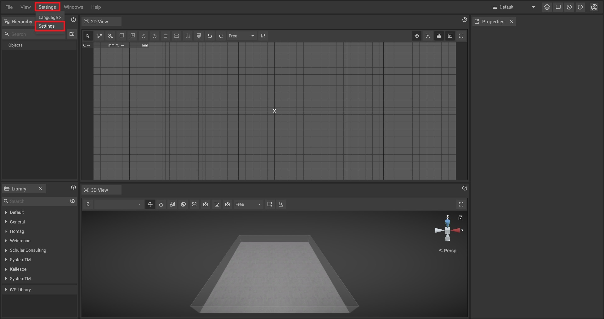

# Settings Panel

The settings panel offers a variety of options to customize iVP. It is divided into three tabs:

* [Global settings:](../settings/global-settings.md) user interface scale, globally used unit, floor plan settings, etc.
* [Graphic settings:](../settings/graphic-settings-panel.md) resolution, frame rate, graphical quality level, etc.
* [Input manager:](../settings/input-manager.md) keyboard shortcuts
* [Text objects settings:](../settings/text-object-settings.md) Text object behavioural options
* [Library settings:](../settings/library-settings.md) Tag search, include and exclude assets
has context menu
 
## Opening the settings panel step by step:

The settings panel can be opened by simply clicking on **Settings -> Settings** in the top bar of the program.

