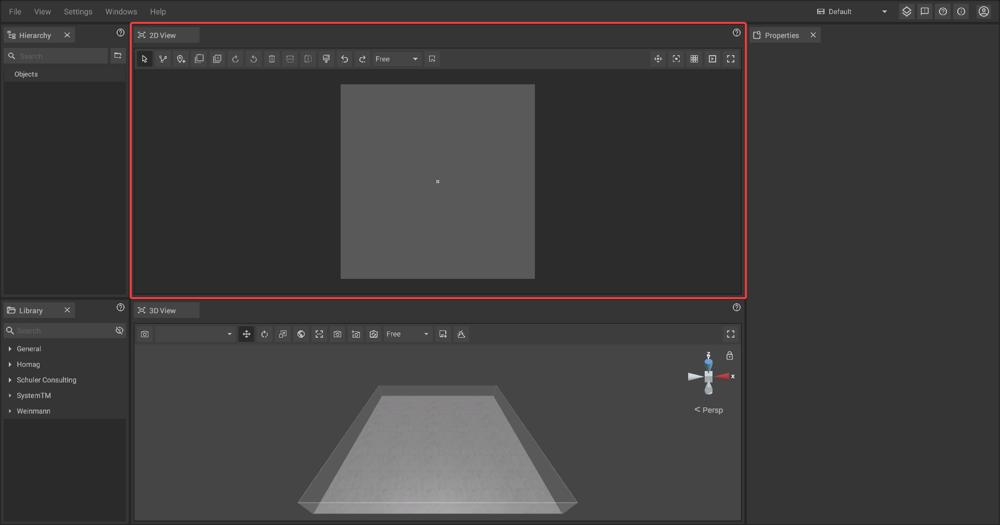

# 2D-Panel

The 2D-Panel acts as planning area where you can [place](../machines/first-steps-with-3d-object.md), [move](../machines/selecting-and-moving-objects.md), [scale and rotate](../machines/rotate-objects.md) machines and objects as if you would work with a traditional floor plan on paper.

## The toolbar of the 2D-Panel:

The toolbar is located at the top of the panel and contains several buttons that give you quick access to 2D-specific functions and settings.

|      |      |
| :--- | :--- |
|  | Switches to a mode that lets you drag and drop machines and objects; if the mouse mode is active, the icon will appear blue. |
|  | Switches to the [path tool mode](../advanced-tools/path-tool.md) which allows you to draw [measurements](../advanced-tools/path-tool.md#measurements), [fences](../advanced-tools/fence-tool.md) and [rooms](../advanced-tools/the-room-tool.md); if the path tool mode is active, the icon will appear blue. |
|  | Switches to the [markup tool mode](../machines/copy-and-delete-objects.md#copy-objects) which allows you to place markups to annotate issues or highlight. |
|  | [Copies ](../machines/copy-and-delete-objects.md#copy-objects)the selected object(s) in a specified direction. |
|  | [Multi-copies](../machines/copy-and-delete-objects.md#multi-copy-objects) the selected object(s) according to definable parameters. |
|  | Rotates the selected object(s) clockwise by a fixed degree (the degree can be adjusted in the [settings panel](settings-panel.md#global-settings)). |
|  | Rotates the selected object(s) anti-clockwise by a fixed degree (the degree can be adjusted in the [settings panel](settings-panel.md#global-settings)). |
|  | [Deletes](../machines/copy-and-delete-objects.md#delete-objects) the selected object(s). |
|  | [Mirrors](../machines/rotate-objects.md#mirror-objects) the selected objects(s) vertically. |
| . | [Mirrors](../machines/rotate-objects.md#mirror-objects) the selected object(s) horizontally. |
|                                           | Highlights the selected object(s) by [coloring](../machines/highlighting-objects.md#coloring-objects) them. |
|  | Undo reverses the last action, allowing you to step back and correct mistakes. |
|  | Redo restores the last action that was undone, allowing you to reapply changes. |
|  | Proportional relationship of the 2D working environment can be adjusted. |
|  | A screenshot of the 2D view can be taken. |
|  | Shows or hides the [mouse coordinates](the-grid.md#mouse-coordinates) in the top left corner of the panel. |                                                                                                                                           
|  | Sets the virtual zero / the reference point of the [grid](the-grid.md) and the [coordinate system](the-grid.md). |
|  | [Toggles the visibility of the grid](the-grid.md#displaying-and-hiding-the-grid). |
|  | Toggles all [animations ](../machines/animations.md)globally without overwriting the animation values set for. |
|  | 2D View is set to full screen mode. |

## Navigation in the the 2D-Panel:

To change the visible area, you can move the camera by holding down the **middle mouse button**. The zoom level can be adjusted by using the **mouse wheel**.
