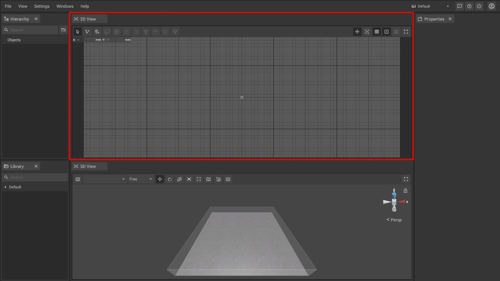

# 2D-Panel

The 2D-Panel acts as planning area where you can [place](../machines/first-steps-with-3d-object.md), [move](../machines/selecting-and-moving-objects.md), [scale](../machines/scale-objects.md) and [rotate](../machines/rotate-objects.md) machines and objects as if you would work with a traditional floor plan on paper.

## The toolbar of the 2D-Panel

The toolbar is located at the top of the panel and contains several buttons that give you quick access to 2D-specific functions and settings.

|                                                                            |                                                                                                                                                            |
| -------------------------------------------------------------------------- | ---------------------------------------------------------------------------------------------------------------------------------------------------------  |
|                | Switches to a mode that lets you drag and drop machines and objects                                                                                        |
|                   | Switches to the [path tool mode](../advanced-tools/path-tool.md) which allows you to draw [measurements](../advanced-tools/path-tool.md#measurements), [fences](../advanced-tools/fence-tool.md) and [rooms](../advanced-tools/the-room-tool.md)                                                                                                                                                                                       |
|                 | Switches to the [markup tool mode](../machines/copy-and-delete-objects.md#copy-objects) which allows you to place markups to annotate issues or highlights |
|                        | [Copies ](../machines/copy-and-delete-objects.md#copy-objects)the selected object(s) in a specified direction                                              |
|                   | [Multi-copies](../machines/copy-and-delete-objects.md#multi-copy-objects-in-the-2d-panel) the selected object(s) according to definable parameters         |
|                | Rotates the selected object(s) clockwise by a fixed degree (the degree can be adjusted in the [settings panel](settings-panel.md#))                        |
|                 | Rotates the selected object(s) anti-clockwise by a fixed degree (the degree can be adjusted in the [settings panel](settings-panel.md#global-settings))    |
|                      | [Deletes](../machines/copy-and-delete-objects.md) the selected object(s)                                                                                   |
|           | [Mirrors ](../machines/mirror-objects.md#mirror-objects-in-the-2d-panel)the selected objects(s) vertically                                                 |
|         | [Mirrors ](../machines/mirror-objects.md#mirror-objects-in-the-2d-panel)the selected object(s) horizontally                                                |
|                    | Highlights the selected object(s) by [coloring](../machines/highlighting-objects.md#coloring-objects)                                                      |
|           | Shows or hides the [mouse coordinates](the-grid.md) in the top left corner of the 2d panel                                                                 |
|                 | Sets the virtual zero / the reference point of the [grid](the-grid.md) and the [coordinate system](the-grid.md)                                            |
|                 | Toggles the visibility of the [grid](the-grid.md#grid-visibility)                                                                                          |
|           | Toggles all [animations ](../machines/animations.md)globally without overwriting the animation values set for individual objects                           |
|                  | Toggles the visibility of the [imported PDF floor plan](../getting-started/importing-pdfs.md)                                                              |
|                  | Toggles fullscreen mode for the 3D panel.md)                                                                                                               |