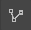

# 2D-Panel

The 2D-Panel acts as planning area where you can [place](../machines/first-steps-with-3d-object.md), [move](../machines/selecting-and-moving-objects.md), [scale and rotate](../machines/scale-and-rotate-objects.md) machines and objects as if you would work with a traditional floor plan on paper.

## The toolbar of the 2D-Panel:

The toolbar is located at the top of the panel and contains several buttons that give you quick access to 2D-specific functions and settings.

|                                                                           |                                                                                                                                                                                                                                                                                                              |
| ------------------------------------------------------------------------- | ------------------------------------------------------------------------------------------------------------------------------------------------------------------------------------------------------------------------------------------------------------------------------------------------------------ |
|                   | Switches to a mode that lets you drag and drop machines and objects; if the mouse mode is active, the icon will appear blue                                                                                                                                                                                  |
|                       | Switches to the [path tool mode](../advanced-tools/path-tool.md) which allows you to draw [measurements](../advanced-tools/path-tool.md#measurements), [fences](../advanced-tools/fence-tool.md) and [rooms](../advanced-tools/the-room-tool.md); if the path tool mode is active, the icon will appear blue |
|                             | Switches to the [markup tool mode](../machines/copy-and-delete-objects.md#copy-objects)which allows you to place markups to annotate issues or highlight                                                                                                                                                     |
|                               | [Copies ](../machines/copy-and-delete-objects.md#copy-objects)the selected object(s) in a specified direction                                                                                                                                                                                                |
|                      | [Multi-copies](../machines/copy-and-delete-objects.md#multi-copy-objects) the selected object(s) according to definable parameters                                                                                                                                                                           |
|                | Rotates the selected object(s) clockwise by a fixed degree (the degree can be adjusted in the [settings panel](settings-panel.md#global-settings))                                                                                                                                                           |
|         | Rotates the selected object(s) anti-clockwise by a fixed degree (the degree can be adjusted in the [settings panel](settings-panel.md#global-settings))                                                                                                                                                      |
|                         | [Deletes](../machines/copy-and-delete-objects.md#delete-objects) the selected object(s)                                                                                                                                                                                                                      |
|               | [Mirrors](../machines/scale-and-rotate-objects.md#mirror-objects) the selected objects(s) vertically                                                                                                                                                                                                         |
|             | [Mirrors](../machines/scale-and-rotate-objects.md#mirror-objects) the selected object(s) horizontally                                                                                                                                                                                                        |
|                       | Highlights the selected object(s) by [coloring](../machines/highlighting-objects.md#coloring-objects) them                                                                                                                                                                                                   |
|                           | Undo reverses the last action, allowing you to step back and correct mistakes                                                                                                                                                                                               |
|                           | Redo restores the last action that was undone, allowing you to reapply changes                                                                                                                                                                                                      |
|                    | Proportional relationship of the 2D working environment can be adjusted                                                                                                                                                                                                 |
|               | A screenshot of the 2D view can be taken                                                                                                                                                                                                |
|           | Shows or hides the [mouse coordinates](the-grid.md#mouse-coordinates) in the top left corner of the panel                                                                                                                                                                                                    |                                                                                                                                           
|                    | Sets the virtual zero / the reference point of the [grid](the-grid.md) and the [coordinate system](the-grid.md)                                                                                                                                                                                              |
|                    | [Toggles the visibility of the grid](the-grid.md#displaying-and-hiding-the-grid)                                                                                                                                                                                                                             |
|            | Toggles all [animations ](../machines/animations.md)globally without overwriting the animation values set for                                                                                                                                                                                                |
|                    | 2D View is set to full screen mode                                                                                                                                                                                                          |

## Navigation in the the 2D-Panel:

To change the visible area, you can move the camera by holding down the **middle mouse button**. The zoom level can be adjusted by using the **mouse wheel**.
