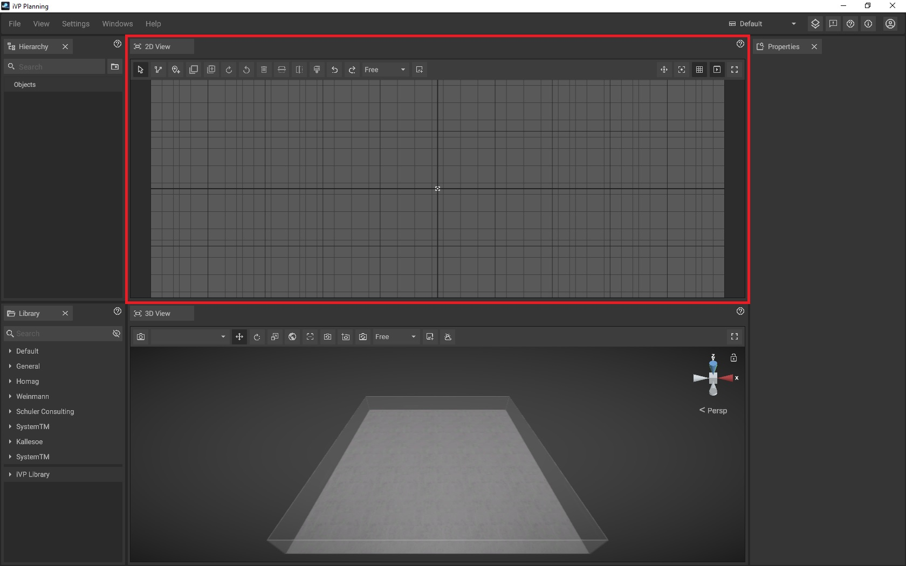

# 2D-Panel

The 2D-Panel acts as planning area where you can [place](../machines/first-steps-with-3d-object.md), [move](../machines/selecting-and-moving-objects.md), [scale and rotate](../machines/scale-and-rotate-objects.md) machines and objects as if you would work with a traditional floor plan on paper.

## The toolbar of the 2D-Panel

The toolbar is located at the top of the panel and contains several buttons that give you quick access to 2D-specific functions and settings.

|                                                                           |                                                                                                                                                                                                                                                                                                               |
| ------------------------------------------------------------------------- | --------------------------------------------------------------------------------------------------------------------------------------------------------------------------------------------------------------------------------------------------------------------------------------------------------------|
|                          | Switches to a mode that lets you select, drag and drop objects. If the mouse mode is active, the icon will appear blue.                                                                                                                                                                                       |
|                    | Switches to the [path tool mode](../advanced-tools/path-tool.md) which allows you to draw [measurements](../advanced-tools/path-tool.md#measurement-display-options), [fences](../advanced-tools/fence-tool.md), [rooms](../advanced-tools/the-room-tool.md) and [ground markings](../advanced-tools/ground-markings.md).    |
|                        | Switches to the [markup tool mode](../advanced-tools/markup-tool.md) which allows you to place markups to annotate or highlight issues.                                                               ,                                                                                     |
|                          | [Copies](../machines/copy-and-delete-objects.md) the selected object(s) in a specified direction.                                                                                                                                                                                                |
|                    | [Multi-copies](../machines/copy-and-delete-objects.md#multi-copy-objects-in-the-2d-panel) the selected object(s) according to definable parameters.                                                                                                                                                                           |
|                | Rotates the selected object(s) clockwise by a degree (can be adjusted in the [settings panel](settings-panel.md#global-settings)).                                                                                                                                                                            |
|        | Rotates the selected object(s) anti-clockwise by a degree (can be adjusted in the [settings panel](settings-panel.md#global-settings)).                                                                                                                                                                       |
|                        | [Deletes](../machines/delete-objects.md) the selected object(s).                                                                                                                                                                                                                      |
|            | [Mirrors](../machines/scale-and-rotate-objects.md#mirror-objects) the selected objects(s) vertically.                                                                                                                                                                                                         |
|          | [Mirrors](../machines/scale-and-rotate-objects.md#mirror-objects) the selected object(s) horizontally.                                                                                                                                                                                                        |
|                 | Highlights the selected object(s) by [coloring](../machines/highlighting-objects.md#coloring-objects) them.                                                                                                                                                                                                   |
|   | Shows or hides the [mouse coordinates](the-grid.md#mouse-coordinates) in the top left corner of the panel.                                                                                                                                                                                                    |
|                            | Reverses the most recent performed action.                                                                                                                                                                                                                                                                    |
|                            | Re-Applies the action that was undone using the Undo button.                                                                                                                                                                                                                                                  |
|              | Sets the virtual zero / the reference point of the [grid](the-grid.md) and the [coordinate system](the-grid.md).                                                                                                                                                                                              |
|                 | [Toggles the visibility of the grid](the-grid.md#displaying-and-hiding-the-grid).                                                                                                                                                                                                                             |
|           | Toggles all [animations](../machines/animations.md) globally without overwriting the animation values set for objects.                                                                                                                                                                                        |
|                      | Activates the fullscreen mode for the 2D panel.                                                                                                                                                                                                                                                               |

## Navigation in the the 2D panel

To change the visible area, you can move the camera by holding down the **middle mouse button**. The zoom level can be adjusted by using the **mouse wheel**.