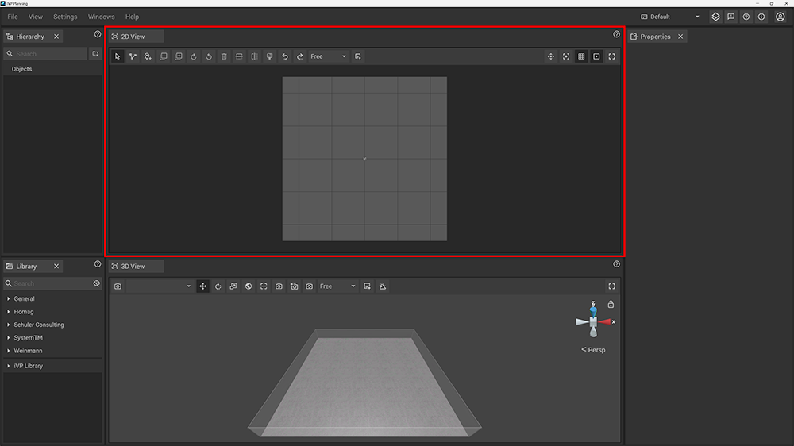

The 2D View acts as planning area where you can [place](../machines/first-steps-with-3d-object.md), [move](../machines/move-objects.md), [scale and rotate](../machines/rotate-objects.md) machines and objects as if you would work with a traditional floor plan on paper.

# The toolbar of the 2D View

The toolbar is located at the top of the panel and contains several buttons that give you quick access to 2D-specific modes, functions and settings. The one you are currently using is highlighted with a darker background.

|     |     |
| --- | --- |
|  | The __Regular Mode__ lets you select, drag and drop machines and objects. |
|  | The __Path Mode__ enables the [path tool](../advanced-tools/path-tool.md) which allows you to draw [measurements](../advanced-tools/path-tool.md#measurements), [fences](../advanced-tools/fence-tool.md) and [rooms](../advanced-tools/the-room-tool.md). |
|  | __Place New Markup__ accesses the [markup tool mode](../machines/copy-and-delete-objects.md#copy-objects) which allows you to place markups inside your project to hightlight, annotate or comment it. |
|  | [__Copy__](../machines/copy-and-delete-objects.md#copy-objects) the selected object(s) in a specified direction next to each other. |
|  | [__Multi Copy__](../machines/copy-and-delete-objects.md#multi-copy-objects) the selected object(s) according to definable parameters. |
|  | __Rotate__ the selected object(s) __clockwise__ by a fixed degree that you can preset in the [settings panel](settings-panel.md#global-settings). |
|  | __Rotate__ the selected object(s) __counterclockwise__ by a fixed degree that you can preset in the [settings panel](settings-panel.md#global-settings). |
|  | [__Delete__](../machines/copy-and-delete-objects.md#delete-objects) the selected object(s). |
|  | [__Mirror__](../machines/rotate-objects.md#mirror-objects) the selected objects(s) __vertically__. |
| . | [__Mirror__](../machines/rotate-objects.md#mirror-objects) the selected object(s) __horizontally__. |
|  | [__Colorize__](../machines/highlighting-objects.md#coloring-objects) the selected object(s). |
|  | __Undo__ reverses the last action, allowing you to step back and correct mistakes. |
|  | __Redo__ restores the last action that was undone, allowing you to reapply changes. |
|  | __Aspect Ratio__ lets you choose a proportional relationship to apply to the window of your 2D View. |
|  | [__Create__ a __screenshot__](../advanced-tools/creating-screenshots.md) of your current 2D view. |
|  | __Show Mouse Coordinates__ lets you show/hide the [mouse coordinates](./coordinate-system.md#mouse-coordinates) in the top left corner of the panel. |                              
|  | __Grid Origin__ allows you to set the virtual zero or reference point of the [grid](the-grid.md) and the [coordinate system](./coordinate-system.md). |
|  | With __Toggle Grid__ you can show/hide the grid of the 2D View. |
|  | With __Animations on/off globally__ you can activate/deactivate all [animations](../machines/animations.md) without overwriting the animation settings for [customizable machines](../machines//customizable-machines.md). |
|  | __Fullscreen__ sets the 2D View to fullscreen mode. |

# Camera movement

To move the camera __click and hold the middle mouse button__ while hovering over the 2D View and __move the mouse__ to adjust the camera's position.

To __zoom__ in or out use your __mousewheel__ while hovering over either the 2D View or the 3D View.

To __focus__ on a selected object press the __F__ key. It will now be centered in both the 2D View and the 3D View as well as in the [hierarchy](../getting-started/moving-the-camera.md).