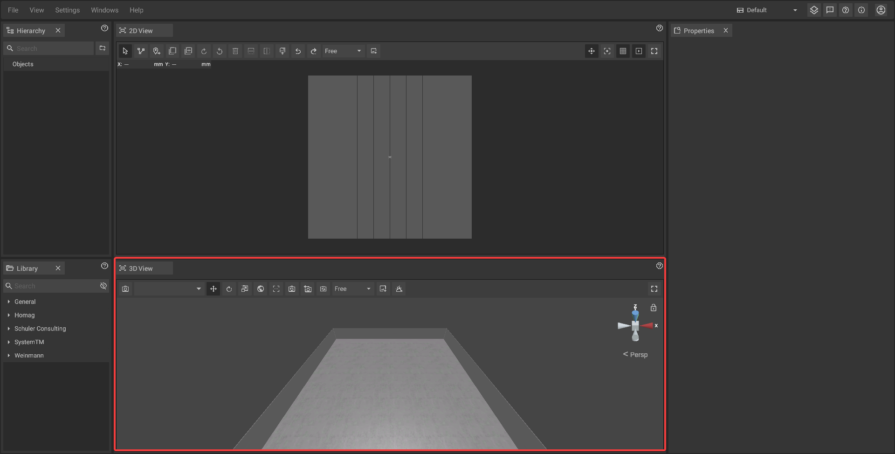
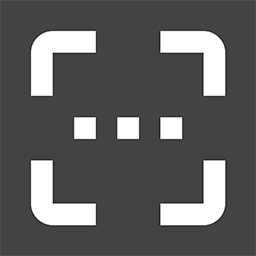
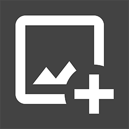

# 3D-Panel

The 3D-Panel acts as a visualization area where you can work in a three dimensional representation of the room or factory. It is possible to [place](../machines/first-steps-with-3d-object.md), [move](../machines/selecting-and-moving-objects.md), [scale and rotate](../machines/scale-and-rotate-objects.md) machines and objects like in the 2D-panel. However, the 3D-panel also offers functions to take [screenshots](../advanced-tools/creating-screenshots.md) or to work with [virtual cameras](virtual-camera-panel.md) to [record videos](../advanced-tools/virtual-cameras.md).

## The toolbar of the 3D-Panel:

The toolbar is located at the top of the panel and contains several buttons that give you quick access to 3D-specific functions and settings.

|      |     |
| ---: | --- |
|  | Switches to a camera mode. |
|  | Allows you to switch between different [virtual cameras](../advanced-tools/virtual-cameras.md). |
|  | Switches to a mode that makes it possible to [move](../machines/selecting-and-moving-objects.md) the selected object(s) by using the mouse; if the mode is active, the background of the icon becomes dark. |
|  | Switches to a mode that makes it possible to [rotate](../machines/scale-and-rotate-objects.md#rotate-objects) the selected object(s); if the mode is active, the background of the icon becomes dark. |
|  | Switches to a mode that makes it possible to [scale](../machines/scale-and-rotate-objects.md#scale-objects) the selected object(s); if the mode is active, the background of the icon becomes dark. |
|  | ?|
|  | ?|
|  | ?|
|  | ?|
|  | ?|
|    | ?|
|  | Takes a [screenshot](../advanced-tools/creating-screenshots.md) of the 3D-view. |
|  | ?|
