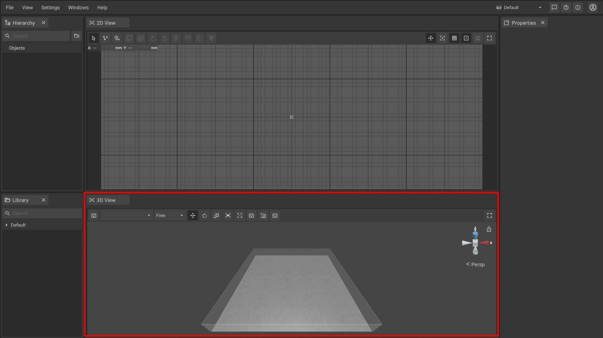

# 3D-Panel

The 3D-Panel acts as a visualization area where you can work in a three dimensional representation of the room or factory. It is possible to [place](../machines/first-steps-with-3d-object.md), [move](../machines/selecting-and-moving-objects.md), [scale](../machines/scale-objects.md) and [rotate](../machines/rotate-objects.md) machines and objects like in the 2D-panel. However, the 3D-panel also offers functions to take [screenshots ](../advanced-tools/creating-screenshots.md)or to work with [virtual cameras](virtual-camera-panel.md) to [record videos](../advanced-tools/virtual-cameras.md).

## The toolbar of the 3D-Panel:

The toolbar is located at the top of the panel and contains several buttons that give you quick access to 3D-specific functions and settings.

|                                                               |                                                                                                                                                   |
| ------------------------------------------------------------- | ------------------------------------------------------------------------------------------------------------------------------------------------- |
|    | Toggle camera mode between free camera mode and bound to                                                                                          |
|     | Allows to switch between different [virtual cameras](../advanced-tools/virtual-cameras.md)                                                        |
|         | Allows to switch between different aspect ratios for the layout                                                                                   |
|           | Switches to a mode that makes it possible to [move ](../machines/selecting-and-moving-objects.md)the selected object(s) by using the mouse        |
|         | Switches to a mode that makes it possible to [rotate ](../machines/scale-and-rotate-objects.md#rotate-objects)the selected object(s)              |
|          | Switches to a mode that makes it possible to [scale ](../machines/scale-objects.md#scaling-objects-in-the-3d-panel)the selected object(s)         |
|     | Creates a [screenshot ](../advanced-tools/creating-screenshots.md) of the current camera view in the [3D view](../user-interface/the-3d-panel.md) |
|            | Changes the field of view of the currently selected [virtual cameras](../advanced-tools/virtual-cameras.md)                                       |
|   | Resets the camera view to a centered default perspective                                                                                          |
|     | Adds a new [virtual camera](../advanced-tools/virtual-cameras.md) (Hotkey B)                                                                      |
|  | Sets the current camera view for the selected [virtual camera](../advanced-tools/virtual-cameras.md)                                              |
|     | Toggles fullscreen mode for the [3D panel](../user-interface/the-3d-panel.md)                                                                     |