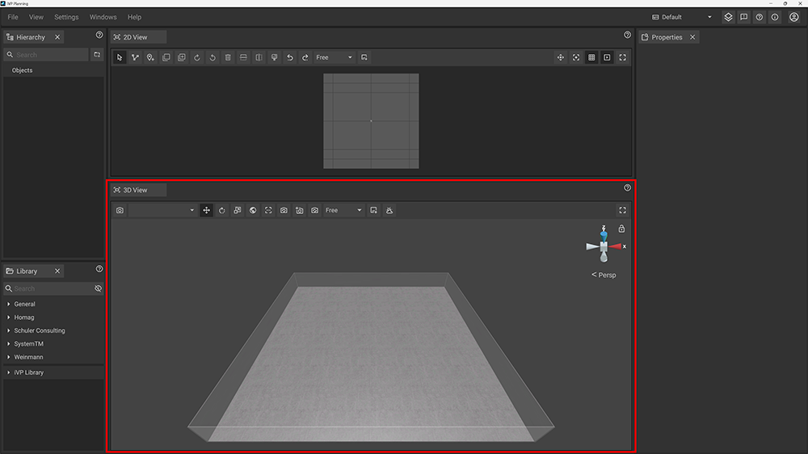

It is possible to [place](../machines/first-steps-with-3d-object.md), [move](../machines/move-objects.md), [rotate](../machines/rotate-objects.md) and [scale](../machines/scale-objects.md) machines and objects like in the 2D View. Furthermore the 3D View offers functions to take [screenshots](../advanced-tools/creating-screenshots.md) or to work with [virtual cameras](./virtual-camera-panel.md) for [recording videos](../advanced-tools/virtual-cameras.md).

## The toolbar of the 3D View

The toolbar is located at the top of the 3D View providing you with quick access to the tools for transformations and functionalities specific to the 3D View.

|      |      |
| :--- | :--- |
|  | __Toggle camera mode__ lets you lock/unlock your viewpoint to a selected virtual camera. |
|  | __Selected View__ allows you to switch between the [virtual cameras](../advanced-tools/virtual-cameras.md) of your scene. |
|  | __3D Move__ enables the mode to [move](../machines/move-objects.md) the selected object(s) in three-dimensional space. |
|  | __3D Rotate__ enables the mode to [rotate](../machines/rotate-objects.md#rotate-objects) the selected object(s) in three-dimensional space. |
|  | __3D Scale__ enables the mode to [scale](../machines/scale-objects.md#scale-objects) the selected object(s) in three-dimensional space. |
|  | __Global Space__ toggles the 3D transformations being applied along either the global space (coordinates) of the scene or the local space (orientation) of the object. |
|  | __FOV__ opens a slider to set the general field of view for your 3D View. |
|  | __Resets the camera view__ sets the current 3D View to its default position and orientation. |
|  | __Add current camera viewpoint__ creates a virtual camera with default settings from your current 3D View and adds it to the [Hierarchy Panel](./hierarchy-panel.md). |
|  | __Update selected Camera__ applies the current position and orientation of your 3D View to the virtual camera selected in the [Hierarchy Panel](./hierarchy-panel.md). |
|  | __Aspect ratio__ lets you choose between a set of common aspect ratios for your 3D View. |
|  | __Create screenshot__ lets you take a [screenshot](../advanced-tools/creating-screenshots.md) of your current 3D View. |
|  | __Skybox__ lets you choose an image file to use as a skybox (backdrop) of your 3D View. |