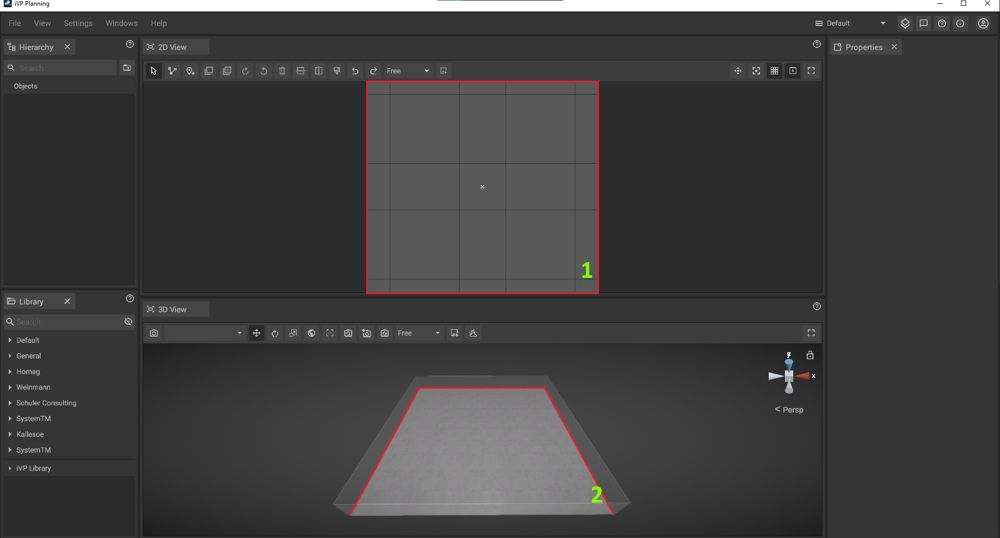

# The Floor Plan

The floor plan defines the virtual room or factory hall in which machines and objects are placed. It is the central element of the [2D view](the-2d-view.md) (1) and the [3D view](the-3d-view.md) (2).


All machines and objects can also be placed outside of the floor plan without any limitations. Although this might not be the typical use case it can be used to temporarily "store" machines. However, a better practice is usually to place the machines in their correct spot on the floor plan and then to [hide](hierarchy-panel.md#hideunhide-objects) them.


## Adjusting the shape and size of the floor plan

The [floor plan](the-floor-plan.md) - the virtual room or factory hall in which machines and objects are placed - can be adjusted in shape and size in four different ways:

* By setting new values for the floor size in the [global settings panel](settings-panel.md#global-settings)
* By [loading a save](../getting-started/loading-projects.md) file with the _"Resize floor to saved dimensions"_  option enabled
* By [importing a floor plan PDF](../getting-started/importing-pdfs.md) with the _"Resize floor to PDF scale"_ option enabled
* By using the [Room Tool](../advanced-tools/the-room-tool.md)

## PDFs as floor plan

It is possible to use a PDF as floor plan by [importing it](../getting-started/importing-pdfs.md). If the project already contains a PDF, it is possible to toggle its [visibility](../getting-started/pdf-visibility.md) or [delete](../getting-started/delete-pdfs.md) it via the [hierarchy panel](../user-interface/hierarchy-panel.md).


Please note that this is a legacy feature and only applies to older plan files in which PDF files were saved as a floor plan beforehand.
