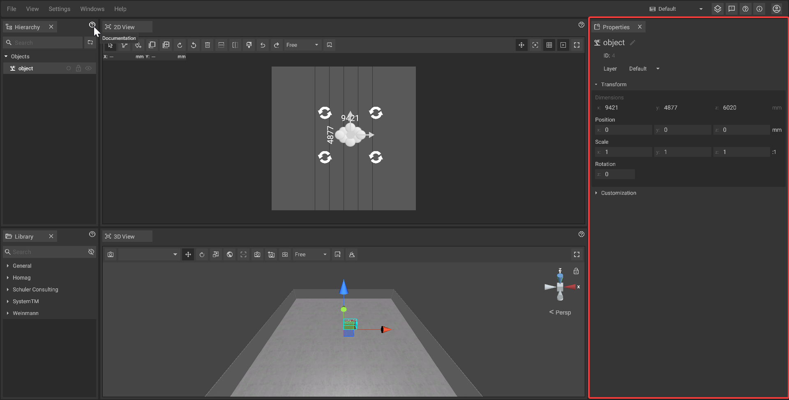

# Properties Panel

The info panel displays several information about the [selected object(s)](../machines/selecting-and-moving-objects.md#select-objects) like name, position or size and makes it possible to change these values. The panel can also contain additional options if the selected object(s) are [customizable](../machines/customizable-machines.md).

## The default fields:

* **Name:** The name of the object which [can be changed](../machines/renaming-objects-and-folders.md) at any time
* **ID:** The unique ID of the object which is generated when the machine is [placed](../machines/first-steps-with-3d-object.md) in the [2D-panel](the-2d-panel.md) or [3D-panel](the-3d-panel.md); the ID is unchangeable and will persist until the object is [deleted](../machines/copy-and-delete-objects.md#delete-objects)
* **Layer:** The object can be assigned to a layer.
* **Transform:**
  * _**Dimensions:**_ It is the size of the object that will be changed by the transformation by scale.
  * _**Position:**_ The [position](../machines/selecting-and-moving-objects.md#move-objects) of the object relative to the current [reference point](the-grid.md#adjusting-the-reference-point) of the [coordinate system](the-grid.md) and its [rotation](../machines/rotate-objects.md#rotate-objects) relative to its default rotation
  * _**Scale:**_ It allows adjusting object size along the X, Y, and Z axes. A 1:1:1 ratio indicates uniform scaling, with changes reflected in the ratio display.
  * _**Rotation:**_ It allows adjusting the orientation around the Z axis in degrees.
* **Customization:** Each object has individual [custumizations](../machines/customizable-machines.md#customizable-machines) and can be adapted there.


The unit of measurement used for the plan (e.g. mm, m or ft) [can be changed](settings-panel.md#global-settings) globally in the [settings panel](settings-panel.md).


