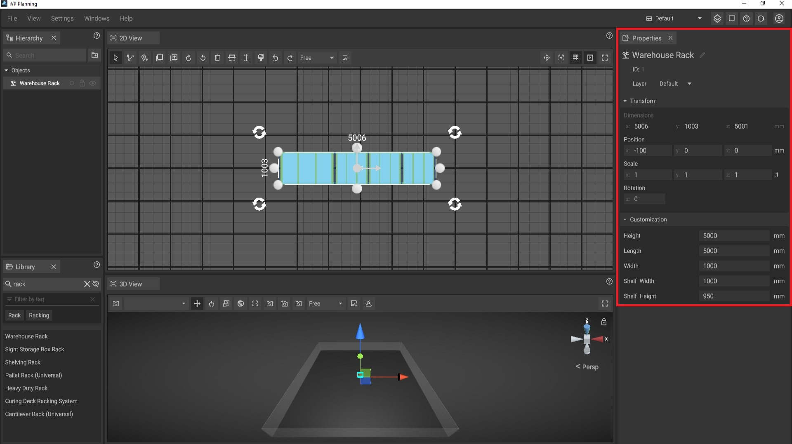
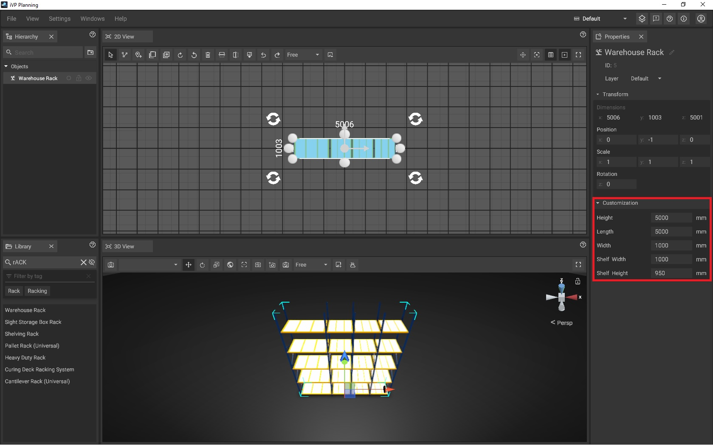

# Properties Panel

The propertie panel displays several information about the [selected object(s)](../machines/selecting-and-moving-objects.md#select-objects) like name, position or size and makes it possible to change these values. The panel can also contain additional options if the selected object(s) are customizable.

## The default options

* **Name:** The name of the object which [can be changed](../machines/renaming-objects-and-folders.md) at any time.

* **ID:** The unique ID of the object which is generated when the machine is [placed](../machines/first-steps-with-3d-object.md)in the [2D-](the-2d-panel.md) or [3D-panel](the-3d-panel.md); the ID is unchangeable and will persist until the object is [deleted](../machines/copy-and-delete-objects.md#delete-objects).

* **Layer:** Determines the display layer for the object; for instance, assigning it to the 'Default' layer will hide it when the 'Building' layer is selected.

* **Position:** The [position](../machines/selecting-and-moving-objects.md#move-objects) of the object relative to the current [reference point](the-grid.md#adjusting-the-reference-point) of the[ coordinate system](the-grid.md) and its [rotation](../machines/scale-and-rotate-objects.md#rotate-objects) relative to its default rotation.

* **Scale:** Lets the user change the objects [scale](../machines/scale-objects.md) by changing its individual numerical values.

* **Rotation:** Adjust the rotational angle of the item using numerical values, for example, to 45 degrees.


The unit of measurement used on the grid (e.g. mm, m or ft) [can be changed](settings-panel.md#global-settings) globally in the [settings panel](settings-panel.md).


## Customizable objects

A central element of iVP are the so called "customizable objects". By offering additional customization options tailored to their specific characteristics, customizable objects can be altered far beyond simple scaling or rotation.


For example, consider a machine with variable wagon numbers depending on its working environment. In typical software, adjusting for this variability often involves imprecise stretching, which can lead to inaccuracies. However, in iVP, simply changing a single number in the info panel automatically adjusts the machine to accommodate the new wagon count, including resizing, adding/removing parts, or swapping the entire model.

Customizable machines in iVP offer another advantage: constraints ensure that customization aligns with real-world feasibility, reflecting physical counterparts accurately.



Example: the same machine with 4 wagons and 1 wagon - realized without stretching or workarounds:

&#x20;


## Customize objects via the info panel

To customize a [selected object](selecting-and-moving-objects.md), have a look at the **lower part of the properties panel**. The options available here depend on the object.

