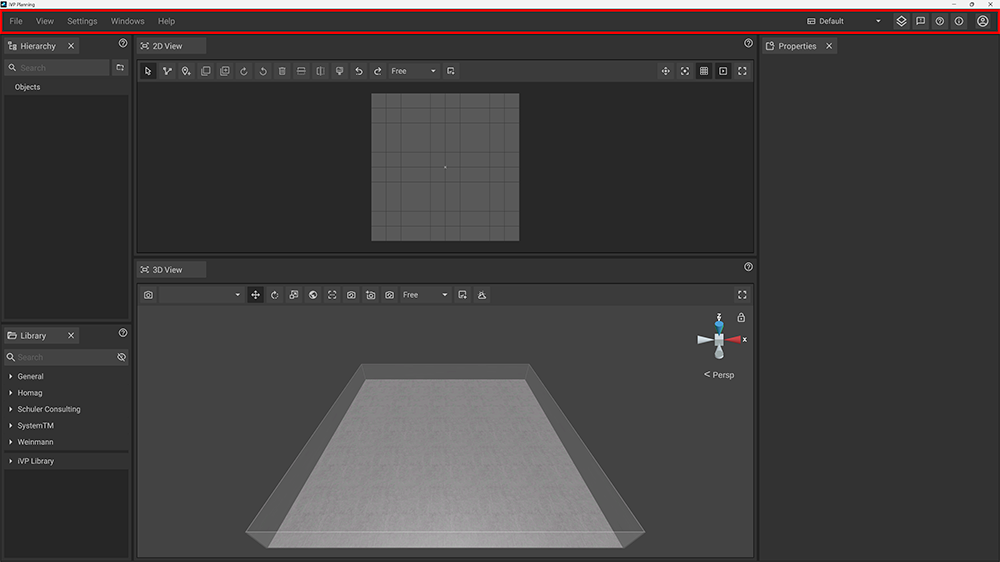

The top bar is located at the top of the screen and contains a text menu with submenus for various purposes on the left side as well as a button menu with general features on the right side.

# Text menu

The text menu contains five submenus: __File__, __View__, __Settings__, __Windows__ and __Help__.

## File

The __File__ menu offers you basic file manipulation like loading, saving, importing, exporting and quitting.

|     |     |
| --- | --- |
| __New__ | Create a new project. |
| __Open__ | [Load](../getting-started/loading-projects.md) an existing project. |
| __Open Recent__ | Select a project you recently worked on from a list to load it. |
| __Open autosave directory__ | Open the autosave directory to go back to or recover a previous state of your project by loading on of the autosaved files.|
| __Save__ | [Save](../getting-started/saving-projects.md) the current project to a .plan file. |
| __Save as__ | [Save a copy](../getting-started/saving-projects.md) of the current project to a .plan file. |
| __Import__ | Import external data that is not part of your library yet. Next to [importing PDF files](../getting-started/importing-pdfs.md) iVP Planning supports a lot of common 3D-/CAD-data formats to load external assets into your project. |
| __Export__ | Export your project in several ways. __Video__ -> [Export a video](../advanced-tools/video-export-tool.md) of your project according to your own settings. __Selection as DXF__ -> [Export a DXF file](../advanced-tools/dxf-tool.md) of your current selection. |
| __PDF__ | Interact with PDF files. __Export PDF__ [Export a PDF file](../getting-started/exporting-pdfs.md) of your project. |
| __Quit__ | Close iVP Planning. |

## View

The __View__ menu lets you configure basic settings of your [2D View](./the-2d-view.md) and [3D-View](./the-3d-view.md).

### Grid
Toggle the [grid ](./the-grid.md) of the 2D View.

### Coordinate System
Toggle the [coordinate system](./coordinate-system.md) that acts as orientation in the 2D View.

### Animations
Toggle all animations globally without overwriting the animation settings for [customizable machines](../machines/customizable-machines.md).

### Overhead View
Toggle between a snapshot-like representation or the current live view of your project inside the 2D View.


You can deactivate the __Overhead View__ to increase the performance of iVP Planning.


### Walls
Hide/Unhide the walls of the [floor plan](./the-floor-plan.md) in the 3D View.

### Ceiling
Hide/Unhide the ceiling of the floor plan in the 3D View.

## Settings

The __Settings__ menu gives you access to the language and other general settings of iVP Planning.

### Language
[Set the language](../getting-started/language-options.md) of iVP Planning.

### Settings
Open the [Settings Panel](./settings-panel.md).

## Window

The __Window__ menu lets you set the basic layout of your user interface and hels you access the panels for the different features of iVP Planning.

### Layout
Open a submenu to choose between five preset [window layouts](./layouts.md): __Default__, __Presentation__, __Simple__, __3D__ or __2D__.

### Hierarchy
Open the [Hierarchy Panel](./hierarchy-panel.md) (open and docked by default).

### Library
Open the [Library Panel](./library-panel.md) (open and docked by default).

### Properties
Open the [Properties Panel](./the-properties-panel.md) (open and docked by default).

### Camera List
Open the [Camera List Panel](./camera-list-panel.md).

### Video
Open the [Video Panel](./virtual-camera-panel.md).

### Settings
Open the [Settings Panel](./settings-panel.md).

### Markups
Open the [Markups Panel](./markups-panel.md).

### Cloud
Open the [Cloud Panel](./cloud-panel.md).

## Help

The __Help__ menu gives you access to bug reporting, the documentation and the version informations of iVP Planning.

### Report a bug
Open the [bug report](../bug-reporting.md) dialog.

### Documentation
Open the [main page](/home/ivp-planning/README.md) of this documentation.

### About
Open a window that gives you information of your currently used version of iVP Planning. You can also access the [changelog](../changelog/README.md) and information about licenses of 3rd party libraries and software used by iVP Planning.

# User menu

The user menu on the right side of the Top Bar gives you quick access to the [__layout presets__](./layouts.md), the project __layers__, __bug reporting__, the __documentation__, the __about__ dialog and your __user account__.

|     |     |
| --- | --- |
|  | __Layout Presets__  opens a small submenu that lets you choose a [window layout](./layouts.md). |
|  | __Layers__  opens a submenu where you can activate/deactivate different layers of your project. |
|  | __Report an Error__  opens the [bug report panel](../bug-reporting.md). |
|  | __Help, FAQ and Documentation__  opens the [main page](/README.md) of this documentation. |
|  | __About iVP__  opens the about dialog, containing the [changelog](../changelog/) and the [3rd Party Licenses](../open-source-licensing.md). |
|  | __User Account__  opens a small submenu where you can log out and see your user profile. |