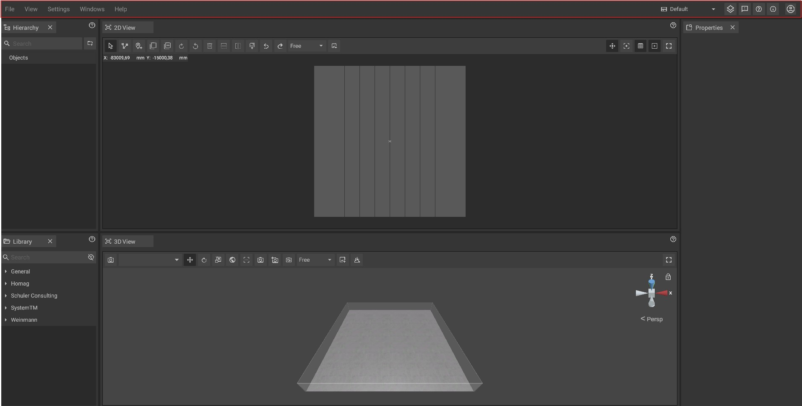

# Top Bar

The top bar is located at the top of the screen and contains a text menu for various purposes as well as shortcuts in the form of different buttons. All elements are explained in detail below.

## Text menu:

The text menu contains four submenus:

* File:
  * _**New:**_ creates a new project
  * _**Open:**_ [loads a project](../getting-started/loading-projects.md)
  * _**Open Recent:**_ opens recent projects
  * _**Open autosave directory:**_ opens the autosave directory  
  * _**Save:**_ [saves the current project](../getting-started/saving-projects.md)
  * _**Save as:**_ [saves a copy of the current project](../getting-started/saving-projects.md)
  * _**Import:**_ [Imports data such as PDFs](../getting-started/importing-pdfs.md) that will be used as floor plan overlay
  *   Export:

      * _**Video:**_ [exports a Video](../getting-started/exporting-videos.md) according to your own settings
      * _**Selection as DXF:**_ [exports in dxf format](../getting-started/exporting-dxf.md) for further processing in CAD or CNC systems.
  *   PDF:

      * _**Export PDF:**_ [exports a PDF](../getting-started/exporting-pdfs.md) of the current project
      * _**Delete PDF:**_ [deletes the PDF](../getting-started/delete-pdfs.md) that currently used as floor play overlay
      
  * _**Quit:**_ closes the program

*   View:

    * _**Grid:**_ toggles the [grid ](the-grid.md)that is visible as floor play overlay in the [2D-Panel](the-2d-panel.md)
    * _**Coordinate System:**_ toggles the [coordinate system](the-grid.md) that acts as orientation in the [2D-Panel](the-2d-panel.md)
    * _**Animations:**_ toggles all animations globally without overwriting the animation values set for [customizable machines](../machines/customizable-machines.md)
    * _**PDF Floor Plan:**_ toggles the visibility of the [PDF](../getting-started/importing-pdfs.md) that acts as an overlay for the [floor plan](the-floor-plan.md)
    * _**Overhead View:**_ toggles between a "snapshot" view and a live view in the [2D-Panel](the-2d-panel.md)
    * _**Walls:**_ toggles the visibility of walls in the [3D-View](the-3d-view.md)
    * _**Ceiling:**_ toggles the visibility of the ceiling in the [3D-View](the-3d-view.md)

* Settings:
  * _**Language:**_ [sets the language](../getting-started/language-options.md) of the software
  * _**Settings:**_ opens the [settings panel](settings-panel.md)

* Windows:
  * _**Layout:**_ Opens a small submenu that lets you choose a [window layout](layouts.md)
  * _**Hierarchy:**_ opens the [hierarchy panel](the-machine-list.md), opened and docked by default
  * _**Library:**_ opens the [library panel](library-panel.md), opened and docked by default
  * _**Properties:**_ opens the [properties panel](the-info-panel.md), opened and docked by default
  * _**Camera List:**_ opens the [camera list panel](camera-list-panel.md)
  * _**Video:**_ opens the [video panel](virtual-camera-panel.md)
  * _**Settings:**_ opens the [settings panel](settings-panel.md)
  * _**Markups:**_ opens the [markups panel](markups-panel.md)

* Help:
  * _**Report a bug:**_ opens the [bug report dialog](../bug-reporting.md)
  * _**Documentation:**_ opens the [main page](../../) of this documentation
  * _**About:**_ opens the about dialog

## Icons

|     |     |
| --- | --- |
|  | __Layout Presets__  Opens a small submenu that lets you choose a [window layout](layouts.md). |
|  | __Layers__  Opens a submenu where you can show or hide layers. |
|  | __Report an Error__  Opens the [bug report panel](../bug-reporting.md). |
|  | __Help, FAQ and Documentation__  Opens the [main page](../../) of this documentation. |
|  | __About iVP__  Opens the about dialog, containing the [changelog](/changelog-panel.md) and the [3rd Party Licenses](../open-source-licensing.md). |
|  | __User Account__  Opens a small submenu where you can log out and see your user profile. |