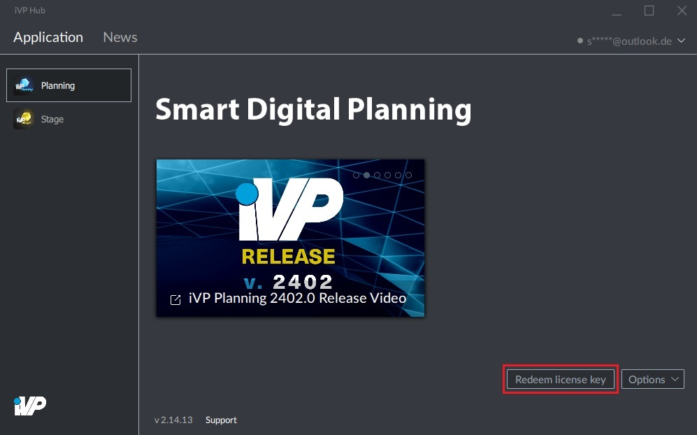

# License Activation

To download the different iVP applications, you will first have to enter a valid key for the particular program.

## Step by step:

**1.** In the "Applications" tab of the iVP Hub choose the application you want to activate on the left side.

**2.** Here, click on "Redeem license".

**3.** A "License key redemption" window will open where you can enter your activation key (the key should have a structure like "88FKH9-E01898-4FE396-47E441-570ACA-3FXB50").

**4.** A click on "Redeem" will finish the activation progress. Now you are ready to [install the application](install-applications.md).

