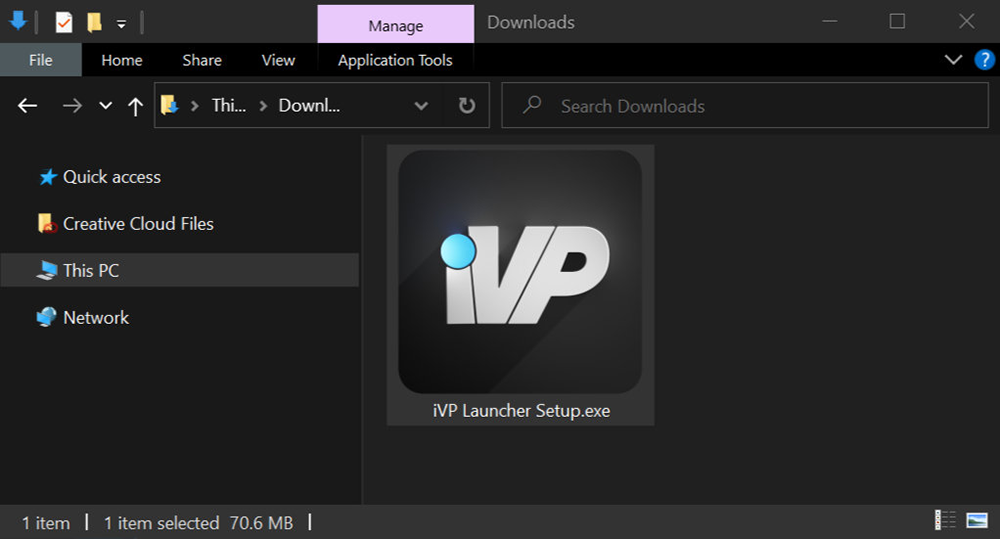
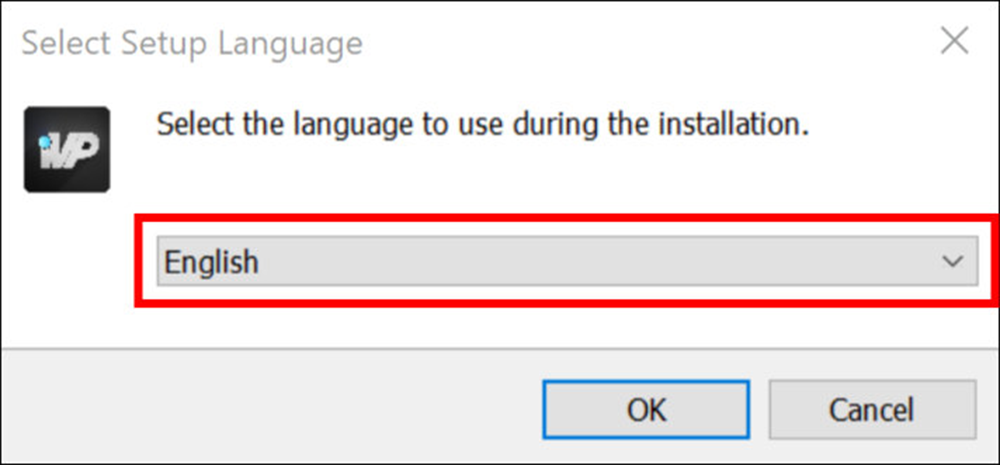
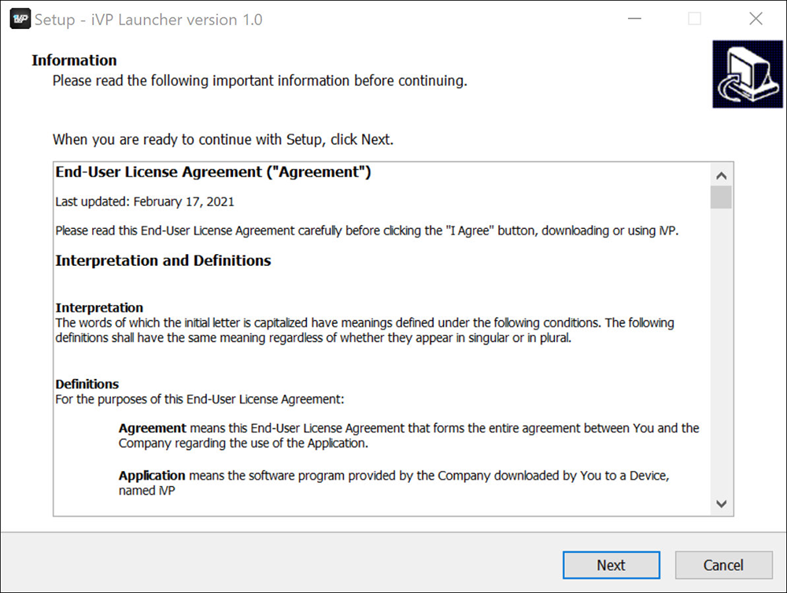
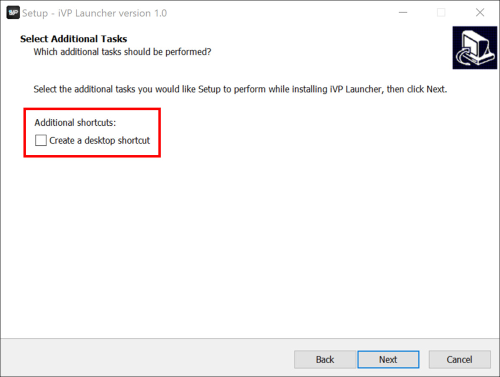
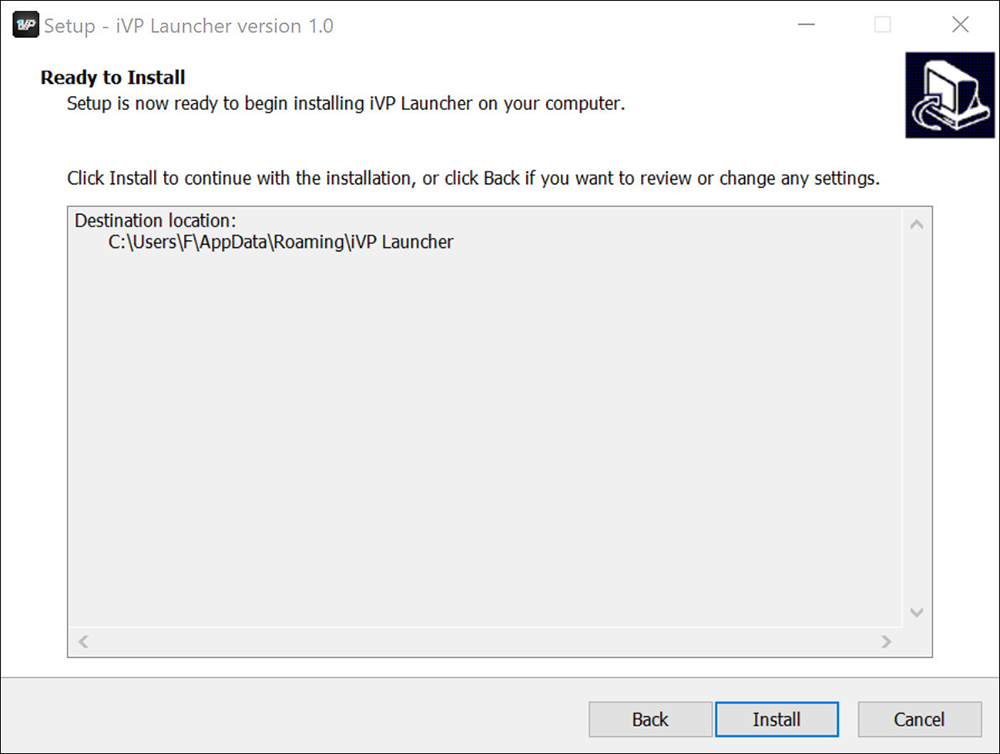
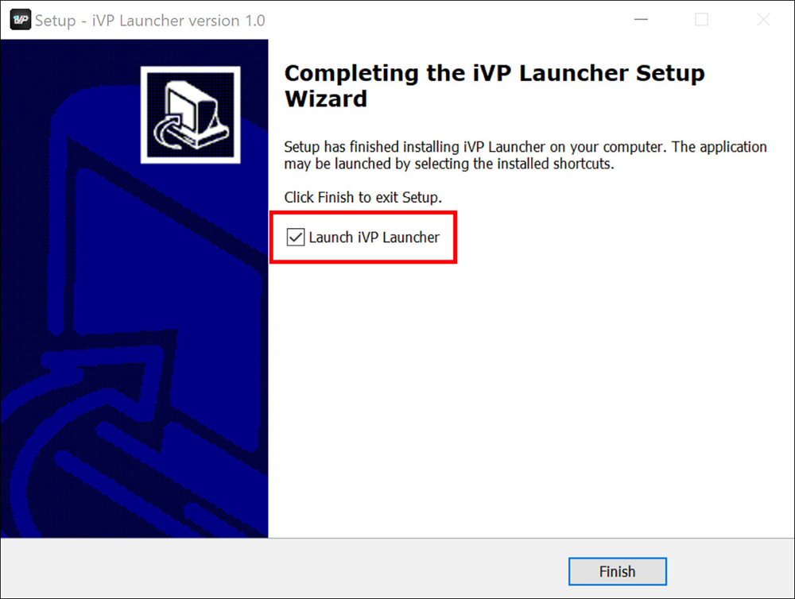

The iVP Hub comes with a common installer to guide you through the installation process step-by-step and to configure basic installation settings on the way.

## Start the installer
To start the installation double click on the .exe file of the iVP Hub installer.

## Set the language
The setup is available in English and German. You can change the language by clicking on the drop-down and selecting your preferred option.

## Read the license
Before procedding with the installation we recommend to have a look at the End-User License Agreement that contains all details concerning legal aspects and usage limitations. By clicking on the __Next__ button to continue with the installation you confirm to the terms and regulations of the End-User License Agreement.

## Create a desktop shortcut
You can choose if the installer creates a desktop shortcut on your computer's desktop by activating/deactivating the checkbox.

## Confirm the installation
Now the iVP Hub is ready for installation. To start the process click the __Install__ button.


Due to the technical structure of the iVP Hub and the iVP applications it is not possible to choose a custom installation folder.


## Launch after install
After the installation process you can choose whether to launch the iVP Hub immediately after exiting the installer by activating/deactivating the checkbox and click the __Finish__ button.

## Next steps
Whatever you decide the iVP Hub is now installed and ready to use. You can continue and [create an account](./account-management/account-creation.md) or [log in](./account-management/login.md) if you already created one. After that you will be ready to [download and use](./application-management/install-applications.md) the different tools of the iVP software family. Enjoy!