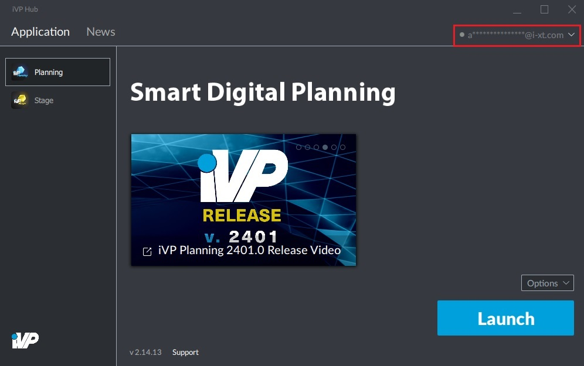

# Hide Hub In System Tray

The iVP Hub can be minimized in the system tray to keep it running in the background without the need to have it opened in the windows taskbar all the time.


The hub will only be minimized to the system tray if its window is minimized. If the window is closed, it will **not** be minimized to the system tray.


## Step by step:

**1.** Open the settings page by clicking on your account name / e-mail address in the top right corner of the window, followed by a click on "Settings".

**2.** Go to the "General" tab.

**3.** Tick the "Hide hub in tray" option.

