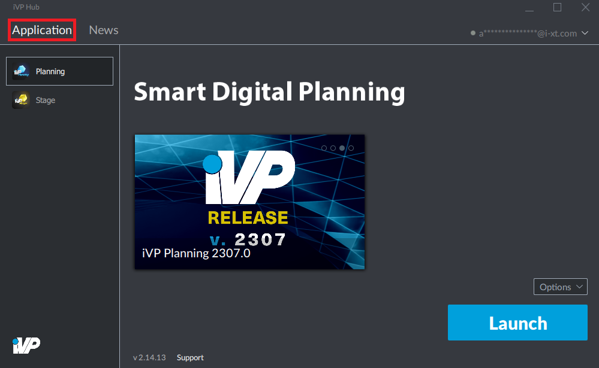
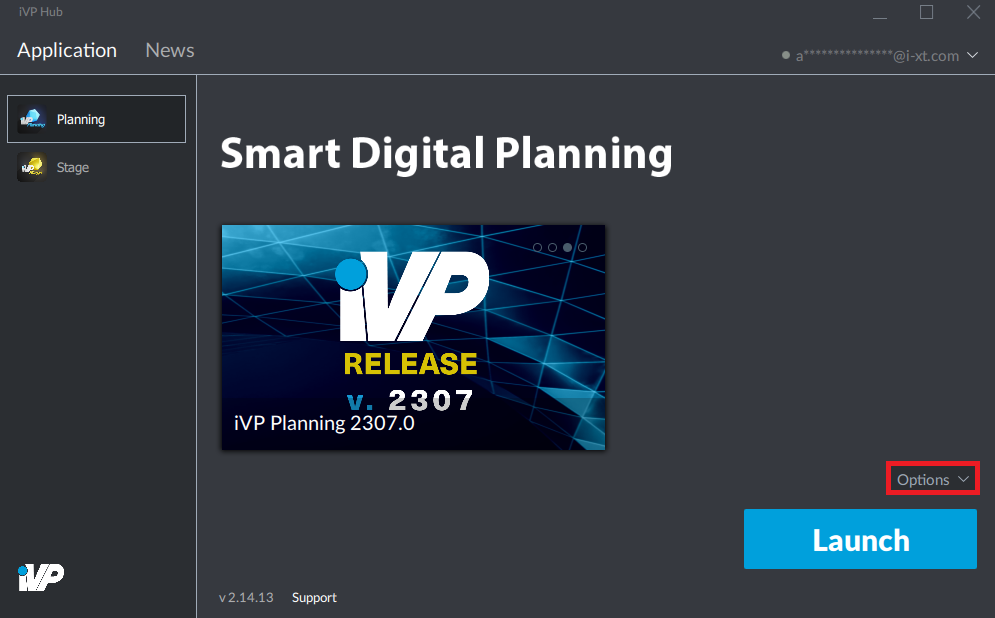
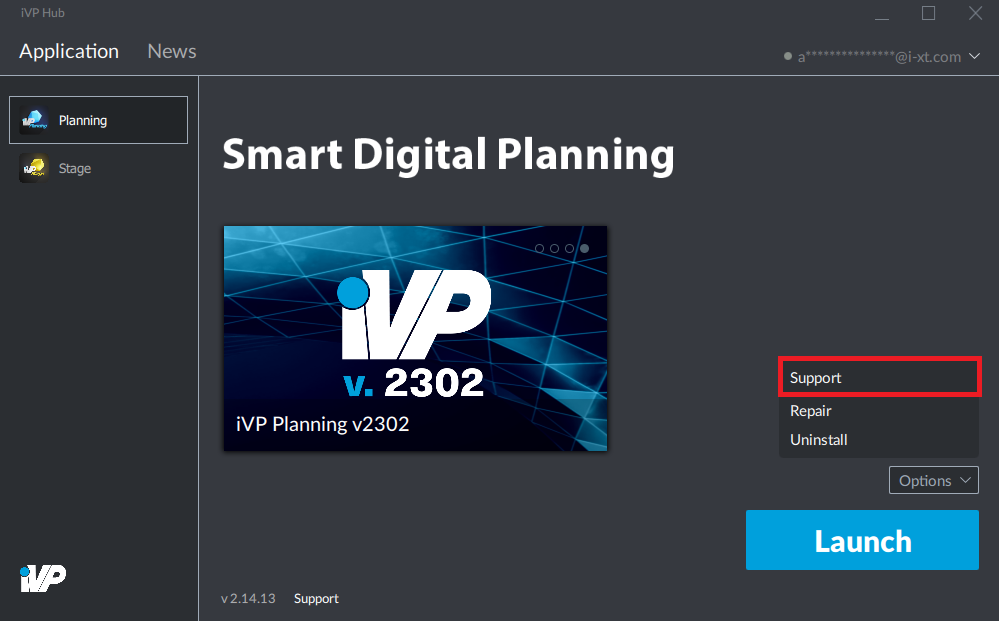

# Support

It is possible to open the [main page of this online manual ](../)directly out of the iVP Launcher interface. To do so, take the following steps:

**1.** Open the "Application" tab.

  

**2.** Click on the "Options" button in the bottom right corner and choose "Support" from the appearing menu.

 

