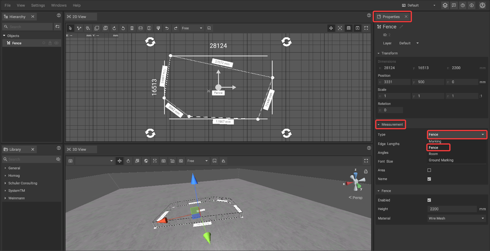
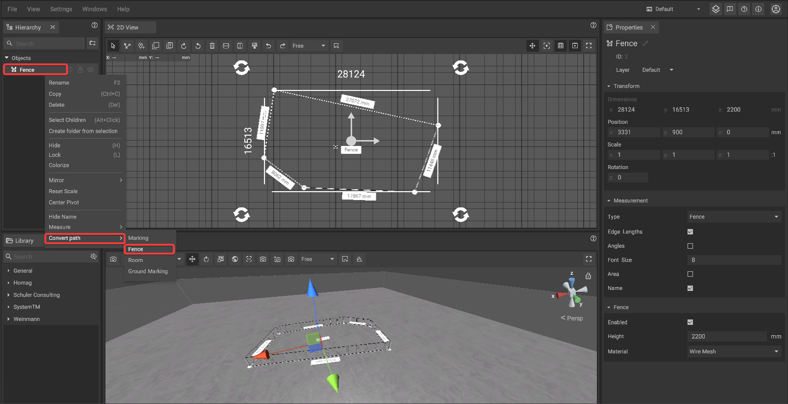
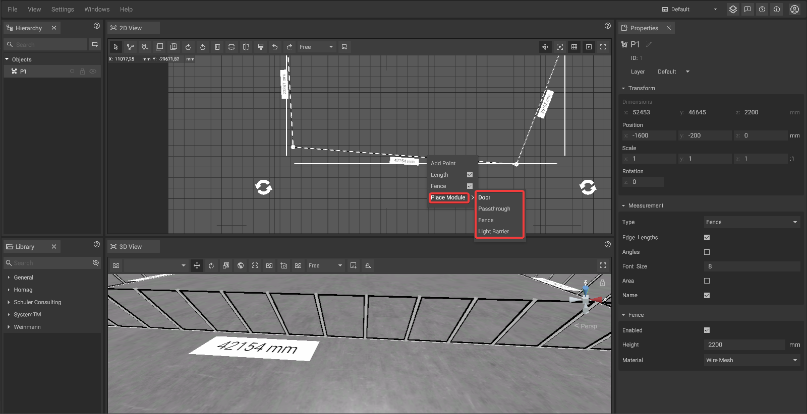
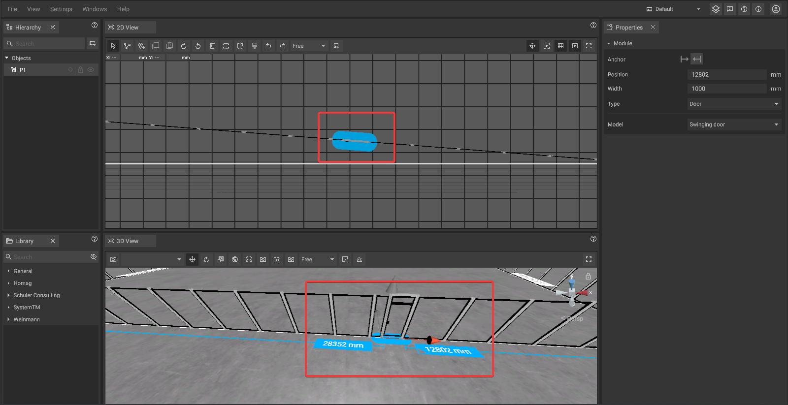
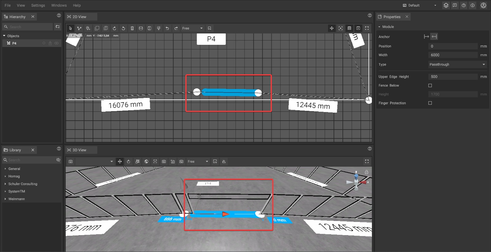
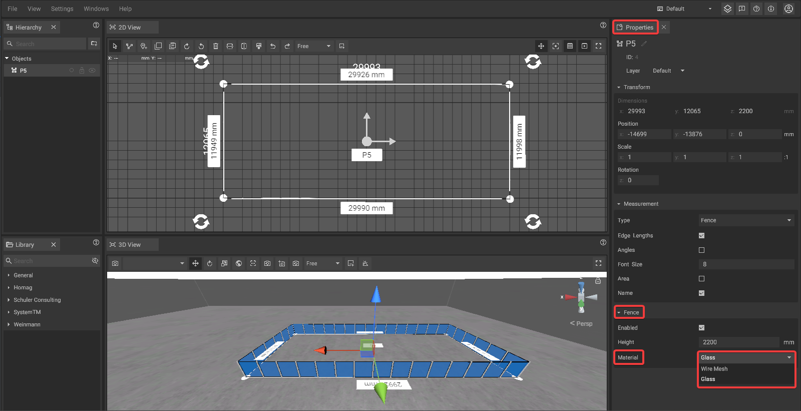

# Fence Tool

The fence tool can be used to quickly generate fences without the need to work with single fence elements or manual corrections after course changes.


The fence tool is a special variant of the [path tool](path-tool.md). We recommend to read the [path tool ](path-tool.md)section of this manual first.


## Creating a Fence

Fences are created based on measurements defined using the [Path Tool](path-tool.md).  
To convert a path into a fence, first [select the path](path-tool.md#path-selection-and-editing).  
Then open the [Properties Panel](./user-interface/the-properties-panel.md), expand the **Measurement** section, and set the **Type** to **Fence**.

Alternatively, you can convert a path into a fence by **right-clicking** on the desired path in the [Hierarchy Panel](./user-interface/hierarchy-panel.md). Then **hover over "Convert path"** and select **"Fence"** from the submenu.  
This will also convert the path into a fence.

## Editing the fence course:

The course of a fence can be changed by [editing the path](path-tool.md#path-selection-and-editing) the fence is based on. After length or direction changes the fence model will automatically be adjusted to the new course.

## Doors and pass-troughs:

It is possible to add doors or pass-troughs to fences which will automatically be adapted when the fence changes in length or direction. To place one, **right-click** on a **path point** of a selected path in the [2D-panel](./user-interface/the-2d-view.md), go to **Place Module**, and choose **"Door"**, **"Pass-through"**, **Fence** or **Light Barrier** from the menu.

Doors are always placed on the right side of the path point and have a fixed width.

Pass-troughs have a flexible width, they always span from the selected point to the next point on its right side.

## Fence types and materials:

To change the material of a fence, select the fence object and go to the [Properties Panel](./user-interface/the-properties-panel.md). Scroll down to the **Fence** section and open the **Material** dropdown. You can choose between **Wire Mesh** and **Glass**. The selected material will be instantly applied to the fence.

