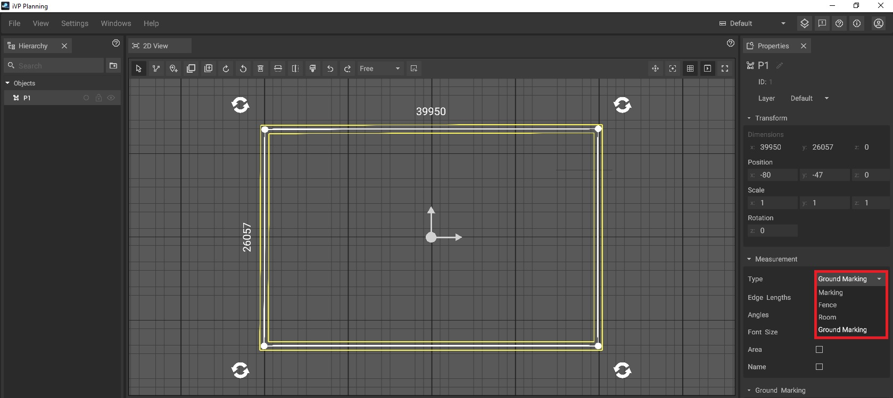

# Ground Markings
 
It is possible to convert your path into a ground marking, enabling you to highlight specific areas with color-coding, which will be visible in the [2D View](./user-interface/the-2d-view.md) and [3D View](./user-interface/the-3d-view.md). To do so, simply change the [paths](path-tool.md) type to **Ground Marking** in the [properties panel](./user-interface/the-info-panel.md).
 

Besides the regular path options, you will also have the option to change the ground markings **line width**, **alignment**, **gap** and its **color** in the [properties panel](./user-interface/the-info-panel.md).  

* **Line width**: Determines the width of the ground markings outer and inner lines.

* **Alignment**: Adjusts the alignment of the ground markings inner and outer lines to:  

Center: The marking is aligned to the drawn path with its center. The yellow lines are positioned parallel to each other, with the drawn path situated between them.  

Inside: The marking is inside the drawn path. The outer line is identical to the drawn line.  

Outside: The marking is outside the drawn path. The inner line is identical to the drawn line.

* **Gap**: Adjusts the distance between the inner and outer lines.

* **Color**: Adjusts the color of the ground marking.

