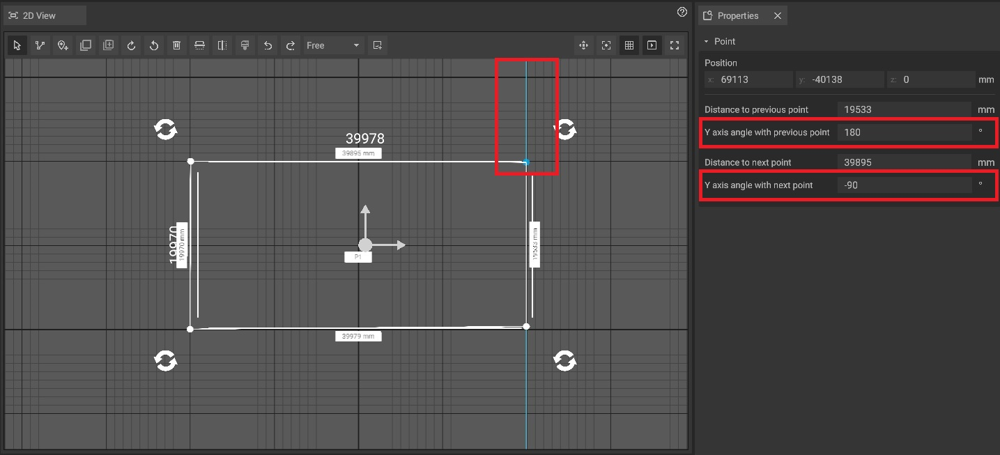

# Path Tool

The path tool is an easy yet remarkably powerful feature of Planning that can be utilized for quick measurements as well as advanced highlighting. In its various forms it can also expedite the creation of complex [ground markings](ground-markings.md), [fences](fence-tool.md#creating-a-fence) and [rooms](the-room-tool.md#creating-a-room).


How to use the path tool


## Path creation, lengths and angles

The path tool can be activated either by clicking on the path tool icon in the [2D View toolbar](./user-interface/the-2d-view.md#the-toolbar-of-the-2D View), or by pressing its shortcut, "P", on your keyboard.

After activation, a small path icon will follow your curser, indicating that you are in the path mode.

To create a path, **left click on a position** in the [2D View](./user-interface/the-2d-view.md) or [3D View](./user-interface/the-3d-view.md). A small circle will appear, indicating the spot of the click and serving as the initial point. When the mouse is moved after the click, a line will appear between the point and the mouse cursor. To add a new point, simply **left click on another position** in either the [2D View](./user-interface/the-2d-view.md) or [3D View](./user-interface/the-3d-view.md).

During the creation process of the path, each line and corner will automatically display its length or angle.

To complete a path, you can either press **Enter** or **double-click on the last point**. Upon completion, the path is saved as a permanent object that can be adjusted or deleted in the [hierarchy panel](./user-interface/hierarchy-panel.md)


If the path contains three or more points, it will automatically be closed after creation (the first and the last points will be connected automatically).


The path creation can be canceled at any time by pressing the **Escape key**. This allows for quick measurement of distances or angles without creating a permanent path.

## Path editing

To add new points to a selected path, **right-click on a line** and then click on **add point**.  

To delete a point, either **right click on the point** and then click on **"Delete"**, or select a point and simply press the Delete button on your keyboard.

To move points, simply **drag them** with the **left mouse button**.  
Points can also be seleceted and moved individually, either in the [2D View](./user-interface/the-2d-view.md) or the [3D View](./user-interface/the-3d-view.md).

### Editing Path Distance and Angles

Existing paths can be further edited to adjust the individual lengths between corner points. To do so, select one of the corner points and edit either the "Distance to previous point" or "Distance to next point" options.

Additionally, you can edit the individual angles of a path. A points angles are measured between the global Y axis and the line between the selected point and it's previous or next point. The blue line that gets displayed when a point is selected serves as a visual indicator for the global Y axis.

## Measurement display options

You can toggle the display of **edge lengths**, **angle** and **area** information for each path by right-clicking on them and selecting the corresponding option in the context menu.

Alternatively it is possible to hide or show all lengths or angles by changing the entry in the measurement section of the [properties panel](./user-interface/the-info-panel.md).

