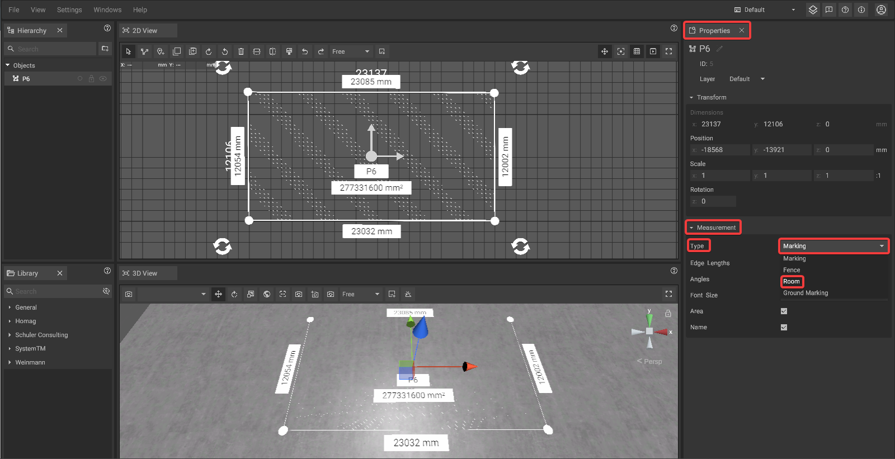
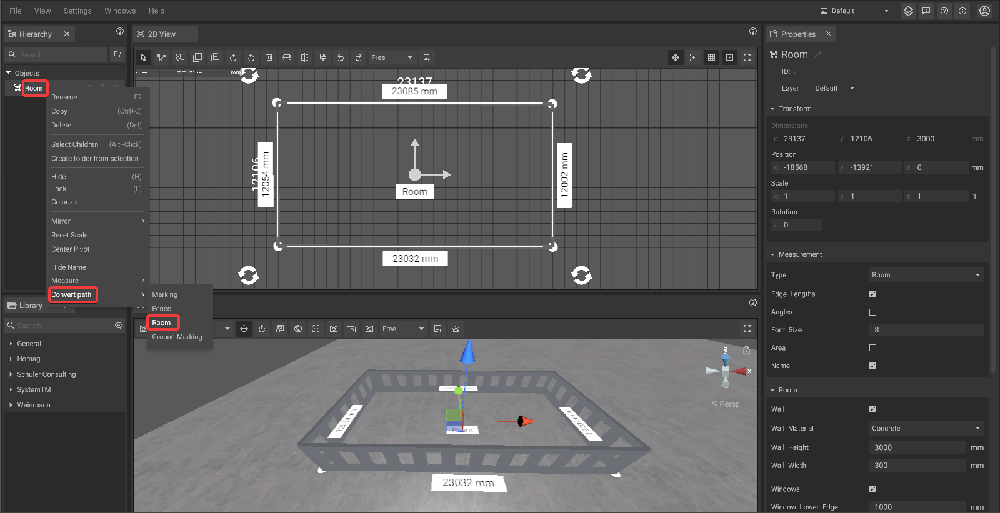
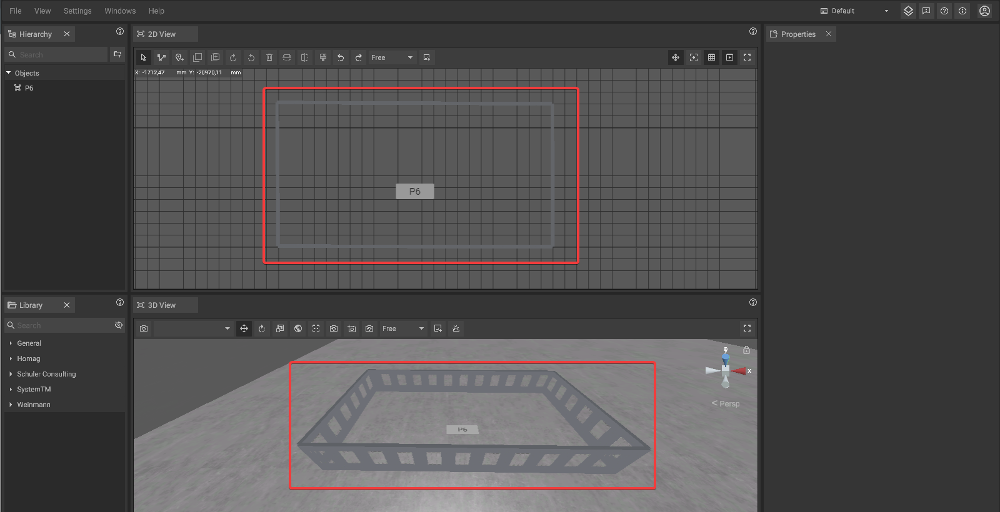

# Room Tool

The room tool can be used to quickly generate room without the need to work with single room elements or manual corrections after dimension changes.


The room tool is a special variant of the [path tool](path-tool.md). We recommend to read the [path tool ](path-tool.md)section of this manual first.


## Creating a room:

Rooms are created based on measurements defined using the [Path Tool](path-tool.md).  
To convert a path into a fence, first [select the path](path-tool.md#path-selection-and-editing).  
Then open the [Properties Panel](./user-interface/the-properties-panel.md), expand the **Measurement** section, and set the **Type** to **Room**.

Alternatively, you can convert a path into a room by **right-clicking** on the desired path in the [Hierarchy Panel](./user-interface/hierarchy-panel.md). Then **hover over "Convert path"** and select **Room** from the submenu.  
This will also convert the path into a room.

## Editing the room shape:

The shape of a room can be changed by [editing the path](path-tool.md#path-selection-and-editing) the room is based on. After changes, the room will automatically be adjusted to the new dimensions.

## Doors and pass-troughs:

It is possible to add doors or pass-troughs to rooms which will automatically be adapted when the room changes. To add one, right **click on a path point** of a selected path in the [2D View](./user-interface/the-2d-view.md) and choose **"Door"** or **"Pass-through"** from the appearing menu.

Doors are always placed on the right side of the path point and have a fixed width.

Pass-troughs have a flexible width, they always span from the selected point to the next point on its right side.

## Room customization:

Rooms can be customized in various ways under the Measurments foldout of the [Properties Panel](./user-interface/the-properties-panel.md) if 'Type' has been changed to room. Options are:

* Wall visibility, material and dimensions
* Window visibility, dimensions, spacing and offset
* Ceiling visibility, material and depth
* Floor visibility, material and height


If the material chosen for the room seems to have a regular pattern that is visually unsatisfying, you can activate the "Texture Detiling" option in the [graphic settings](./settings/graphic-settings-panel.md). This will reduce the pattern effect.


