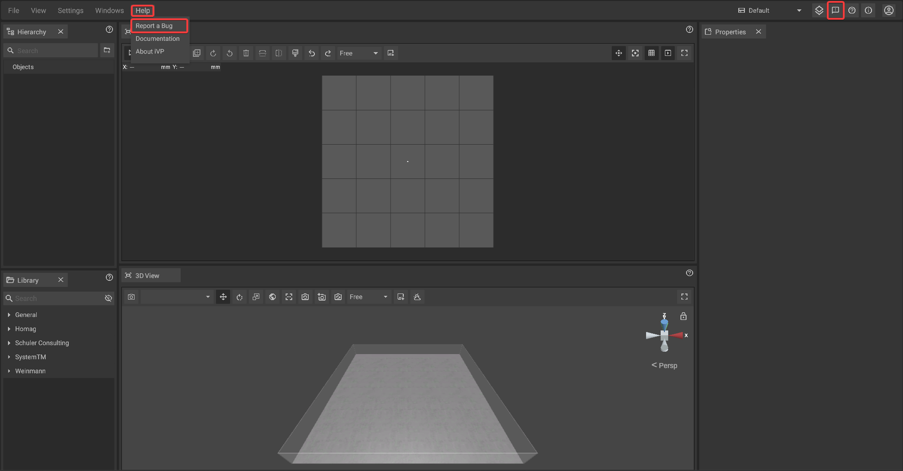
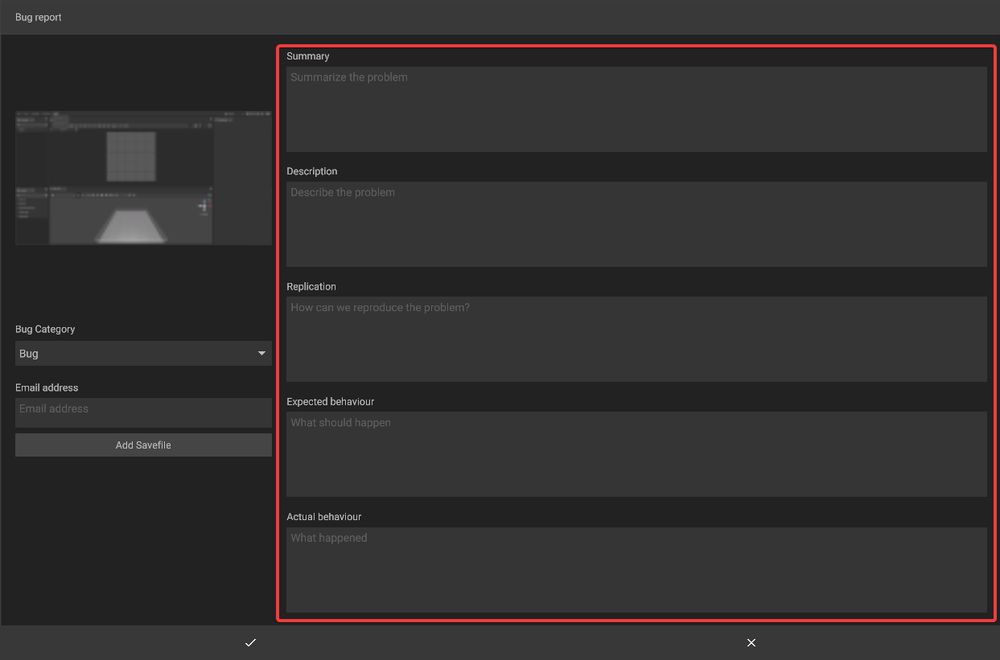
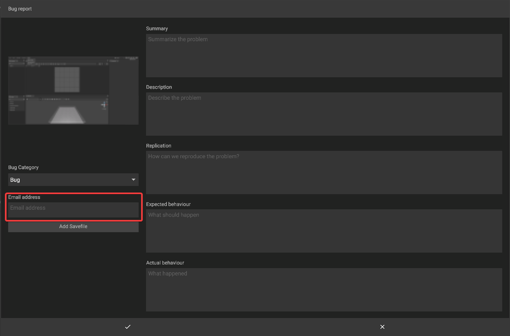
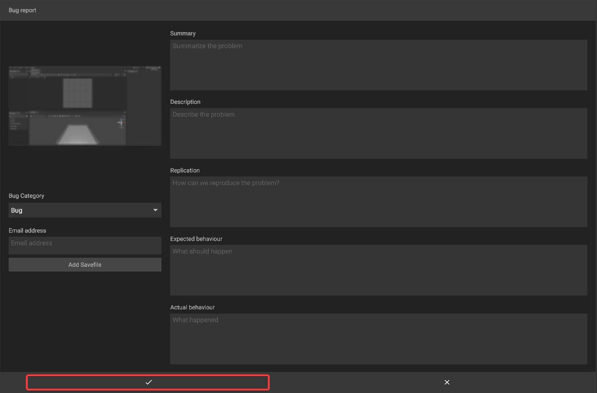

# Bug Reporting

No software is perfect. However, we at iVP are doing our best to fix every bug or problem our users run into. For that reason, you can easily report bugs without leaving iVP Planner.


If the issue is severe (project crashes, freezes or similar) it could be that your local software installation is corrupted. To fix this problem or to verify that this is not the case, you can try to [repair your installation](./ivp-hub/application-management/repair-installations.md) via the [iVP Launcher](./ivp-hub/).


## Report a bug in iVP Planning:

To report a bug, go to **Help -> Report a Bug** or **click on the speech bubble icon with an exclamation mark** in the top right corner of the iVP window.

A new window will open that lets you write down or specify aspects of the bug in a structured way. First of all, you should specify if it a bug or a performance issue.&#x20;

Then you can add information about what you expected, what happened and if you were able to reproduce the problem.

After that you should enter your e-mail address, so that we can contact you if we have further questions. You can also attach a save file of the project if possible - this would help us when it comes to a replication of a bug.

Finally, confirm the bug report with the confirmation button.

