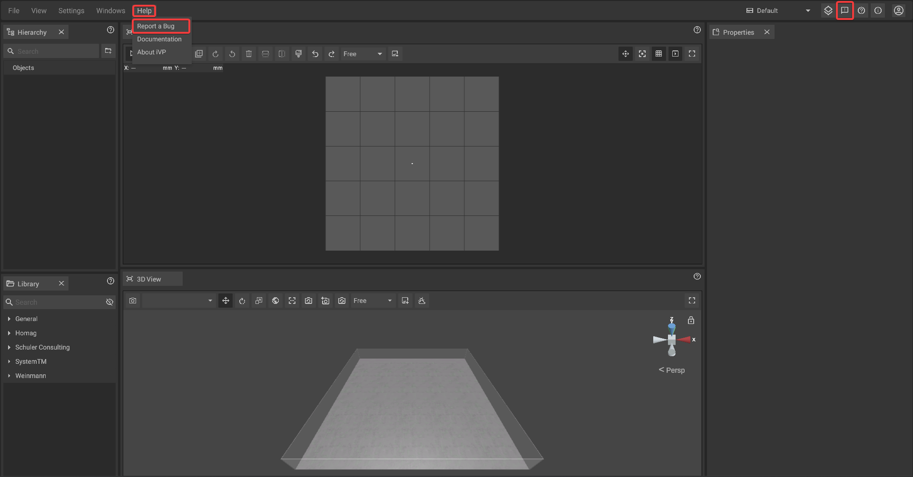
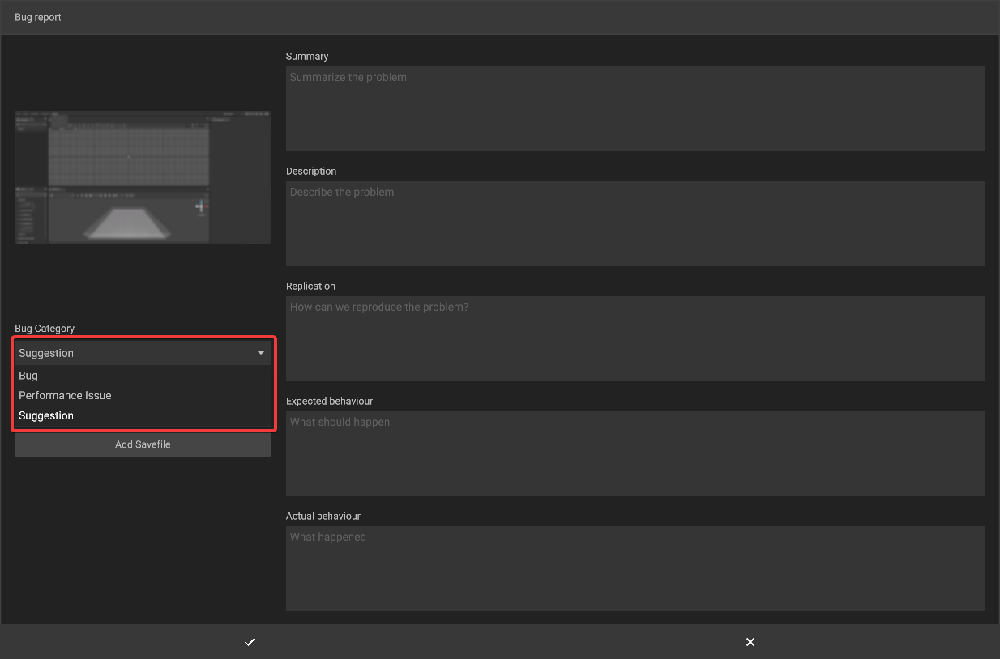
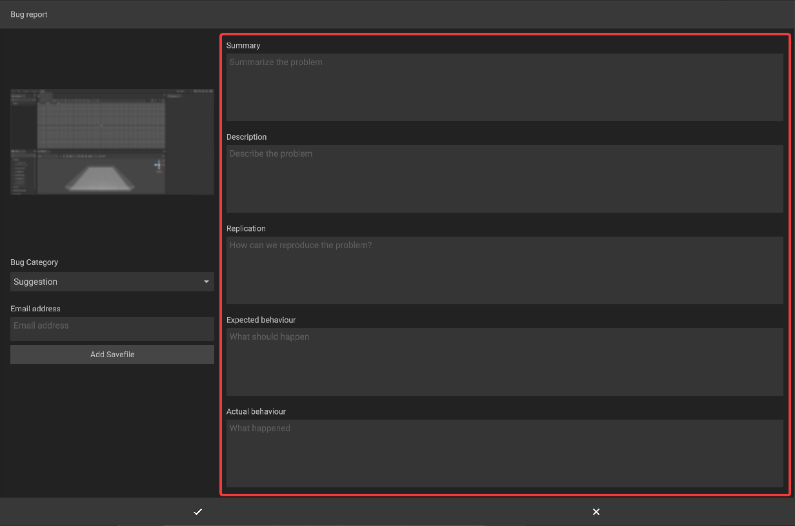
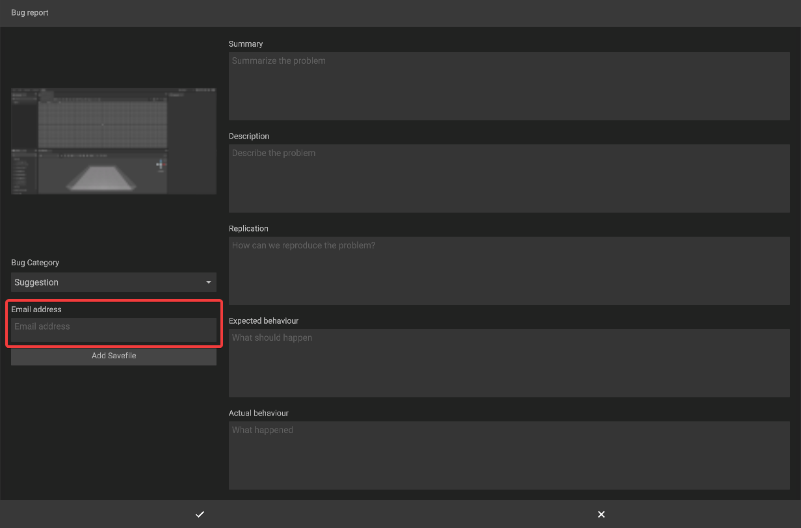
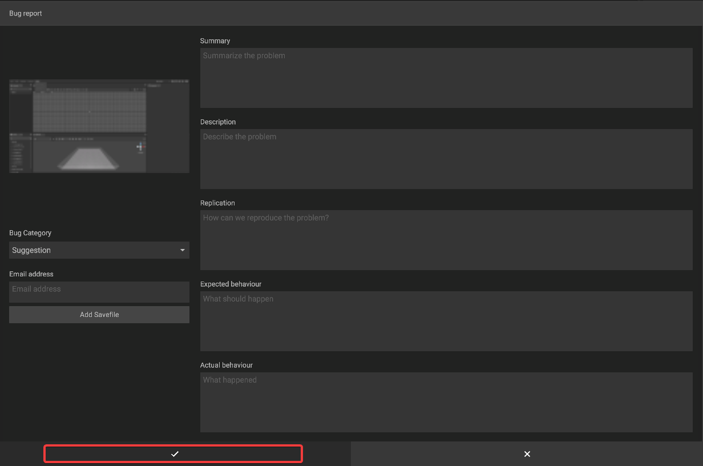

# Feature Requests

You can request a feature or make a suggestion in a similar way like you would [report a bug](bug-reporting.md). To open the required window go to **Help -> Report a Bug** or **click on the speech bubble icon with an exclamation** in the top right corner of the iVP window

Now select "Suggestion" via the bug category drop-down.

Then describe your request or suggestion.

After that you should enter your e-mail address, so that we can contact you if we have further questions.

Finally, confirm the bug report with the confirmation button.

