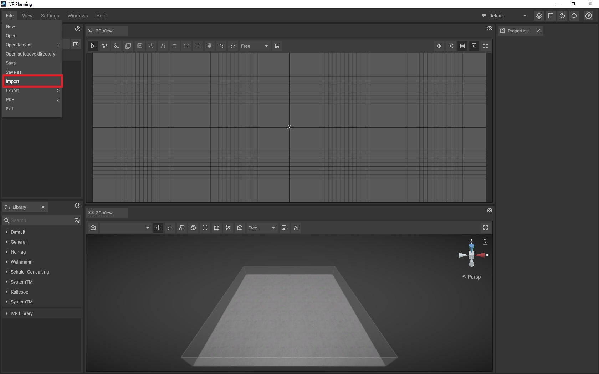
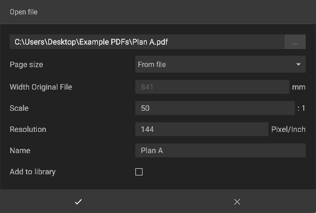

# Importing PDFs

To import a PDF, click on **File -> Import**. A new window will open that allows you to navigate to the folder containing the PDF you want to import.

Before iVP actually processes the PDF and imports it, you will be asked to set some parameters that specify how it will be loaded. The options are:

* **Page Size**: Changes the size of the imported PDF, you can either choose from a preset or manually customize the size of the file. Additionally, you can use the dimensions saved in the PDF.

* **Width Original File**: Displays the original width of the file, which can be adjusted if the file size isn't derived from it. Also changes the overall width and scale of the PDF when modified.

* **Scale**: Adjusts the size ratio of the imported file (e.g. 50:1), thereby proportionately altering its dimensions.

* **Resolution**: Adjusts the resolution of the imported file. Note that higher resolution makes sharper lines, but might impact performance.

* **Name**: Modifies the name of the imported object.

* **Add to Library**: Saves the imported item to your [personal library](./user-interface/library-panel.md).

