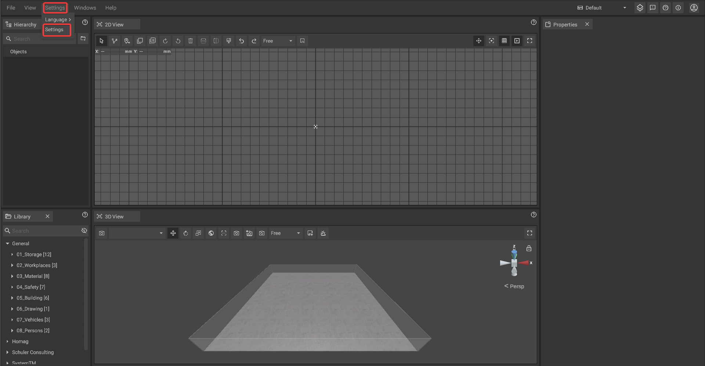

# Animations

Many objects in iVP have animations available that can be turned on for [video production](./advanced-tools/virtual-cameras.md) or general visualization.

## Toggling the animations of single objects:

Animations are a [customization ](customizable-machines.md)that can be turned on and off in the [properties panel](./user-interface/the-properties-panel.md) provided the [selected object](select-objects.md) has an animation available.

## Toggling animations globally:

It is possible to turn on or off all animations globally without changing the animation settings of the individual objects.


When animations are turned on globally only those objects will be animated that had their animation option activated previously in the [properties panel](./user-interface/the-properties-panel.md).


To toggle all animations first open the [global settings](./settings/global-settings.md) by clicking on the entry in the [text menu](./user-interface/the-top-bar.md#text-menu) or the settings button in the [top bar](./user-interface/the-top-bar.md#icons).

In the [global settings](./settings/global-settings.md) tab you can now **check or uncheck the "Animations" option**.

Alternatively you can toggle all animations via the respective entry in the [text menu](./user-interface/the-top-bar.md#text-menu) of the [top bar](./user-interface/the-top-bar.md).

