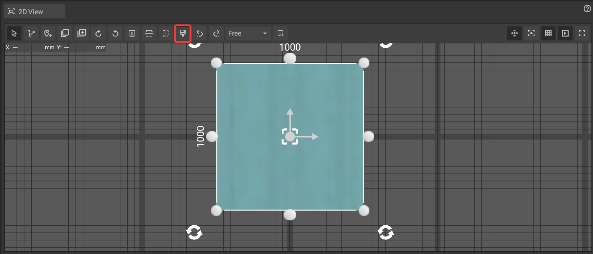
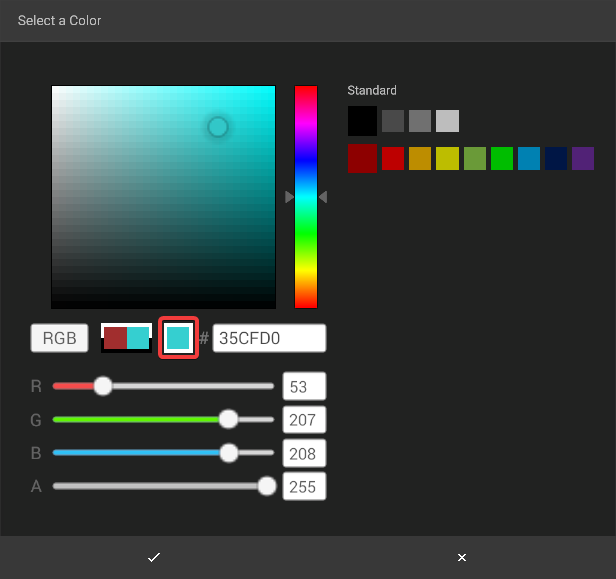
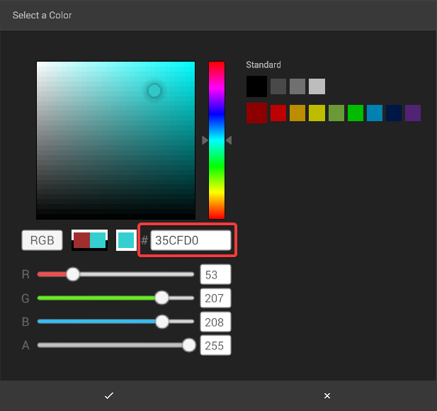
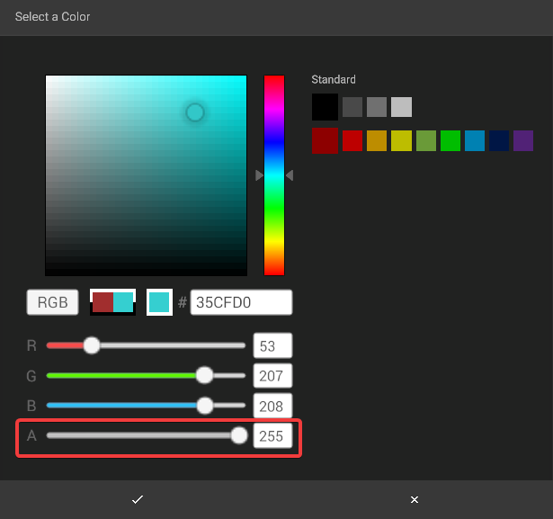
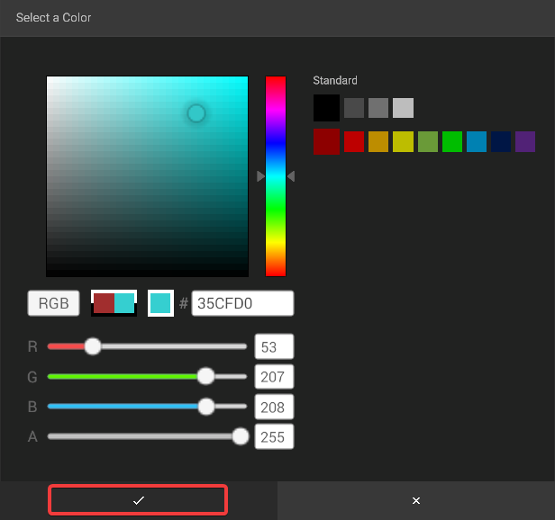

# Highlight Objects

It can be useful to color objects to group them visually or to make specific objects stand out. In iVP you can do so in the [2D View](./user-interface/the-2d-view.md).

## Coloring Objects:

To color a [selected](select-objects.md) object, first click on the color picker icon in the [toolbar of the 2D View](./user-interface/the-2d-view.md#the-toolbar-of-the-2D View).

A window will open where you can specify a color by either **clicking on the colored fields** at the top, by entering a **hex-code** in the field with the "#" or by using the **"R", "G" and "B" slider**. The final color is visible in the square in the center of the window.

To change the alpha (= transparency) of the color use the **"A" slider**. Lower values will result in a color that is more transparent.

If you prefer to work with hue, saturation and value instead of of red, green and blue values you can switch to a HSV mode by clicking on the **"HSV" button**.

To finish, click the **Confirm button**.

