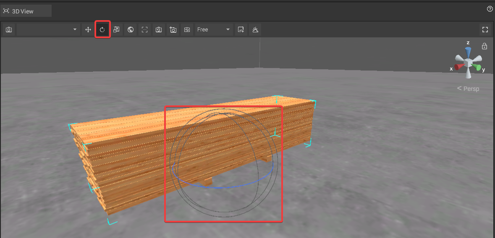

# Rotate Objects

In iVP, all objects can be rotated to adjust them to specific needs.


How to rotate objects (german)



Currently it is only possible to rotate objects around a vertical axis. A free rotation is currently in development.


## Rotating objects in the 2D View:

To rotate an object in the [2D View](./user-interface/the-2d-view.md) **drag and drop the arrows** near the corners of the object.

If you are using a tablet or a laptop or if you want a quick standard rotation, you can also use the **rotation buttons** in the [toolbar of the 2D View](./user-interface/the-2d-view.md#the-toolbar-of-the-2D View). The rotation amount per click can be changed in the [global settings](./settings/global-settings.md).

## Rotating objects in the 3D View:

To rotate an object in the [3D View](./user-interface/the-3d-view.md) first make sure that you activated the **rotation mode** by clicking on the respective button of the [3D View toolbar](./user-interface/the-3d-view.md#the-toolbar-of-the-3D View).

As soon as you are in the rotation mode, the handle in the center of the object will change to a virtual sphere represented by three circles. **Drag one of the circles** to rotate around the respective axis.

## Rotating objects via the properties panel:

It is possible to rotate an object via **text input** in the [properties panel](./user-interface/the-properties-panel.md). The number entered in the field equals the clockwise rotation around a vertical axis.

