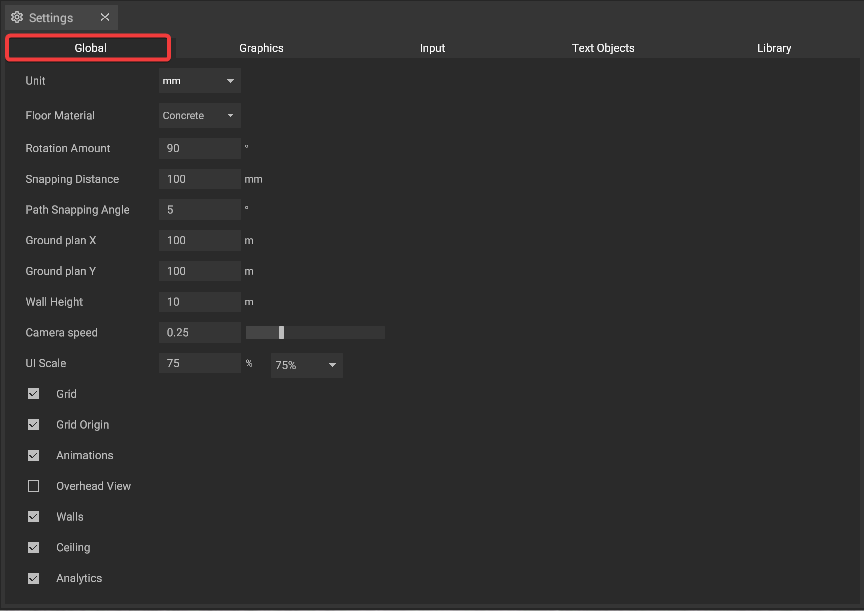

# Global Settings

The global settings offer different options to adjust the [user interface](./user-interface/) and the [floor plan](./user-interface/the-floor-plan.md). They can be changed via the [settings panel](./user-interface/settings-panel.md).

## Settings

* **Unit**: Set the measurement unit used in the project. Available units are _mm_, _cm_, _dm_, _m_ and _ft_.
* **Floor Material**: Change the visual appearance of the floor in the scene. You can choose between _Invisible_, _Light Gray_, _Gray_, _Dark Gray_ and _Concrete_.
* **Rotation Amount**: Change the angular step (in degrees) used when rotating objects. You can set a value between _1_ and _90_ degrees.
* **Snapping Distance**: Change how close objects must be to [snap](./machines/snapping.md) into place either with each other or with the grid when moving or placing them. You can set a value between _1_ and _1000_ millimeters.
* **Path Snapping Angle**: Change the angular step (in degrees) used when snapping rotation or directions along a path. You can set a value between _0.001_ and _360_ degrees. 
* **Ground plan X**: Change the ground plane size along the X-axis (in meters). You can set a value between _10_ and _1000_ meters.
* **Ground plan Y**: Change the ground plane size along the Y-axis (in meters). You can set a value between _10_ and _1000_ meters.
* **Wall Height**: Change the wall height. You can set a value between _1_ and _50_ meters.
* **Camera Speed**: Control how fast the camera moves when navigating the scene. You can set a value (factor) between _0_ and _1_.
* **UI Scale**: Adjust the scaling of the user interface elements. You can set a custom value between _65_ and _125_ percent or choose a preset.
* **Grid**: Show or hide the [grid](./user-interface/the-grid.md) in the 2D view.
* **Grid Origin**: Show or hide the [origin point of the grid](./user-interface/the-grid.md#grid-origin) in the 2D view.
* **Animations**: Toggle the [animations](./machines/animations.md) of single objects.
* **Overhead View**: Allow animations to be visible in the 2D view. This setting can have an impact on performance.
* **Walls**: Show or hide the walls surrounding your scene.
* **Ceiling**: Show or hide the ceiling of your scene.
* **Analytics**: Enable or disable the Analytics.