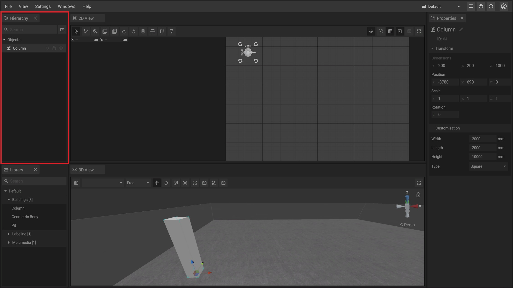
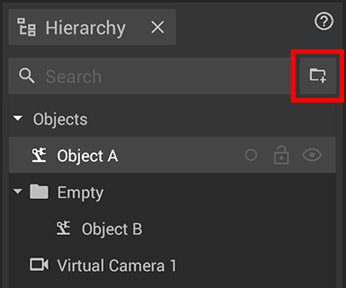
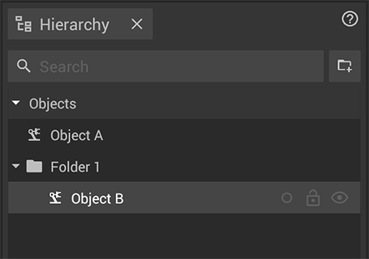
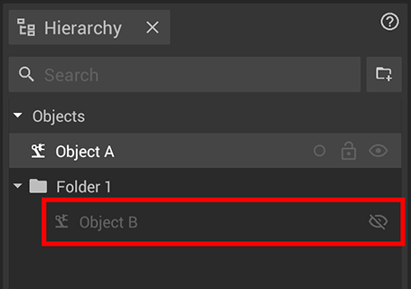
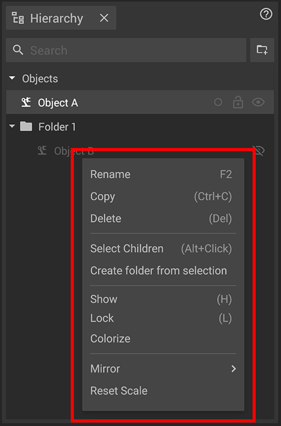

The Hierarchy Panel provides you with a tree view of all the objects your project currently contains. Every object that is added to your project will get an associated entry in the Hierarchy Panel during its creation. It is possible to collect objects in [folders](#folders), to [rename](./machines/renaming-objects-and-folders.md) objects and folders, to toggle their [visibility](#hide-unhide-objects) or to [lock](#lock-unlock-objects) them to prevent unwanted changes.

## The elements of the panel

|     |     |
| --- | --- |
|  | The __Search Bar__ makes it possible to filter machines or objects inside the hierarchy by name. The search is not case sensitive. |
|  | __New Folder__ adds a new folder to the hierarchy. |
|  | __Color__ provides you an indicator of the [color](./machines/highlighting-objects.md) set for the object(s) via the [Colorize](./machines/highlighting-objects.md) tool of the 2D View. |
|  | __Lock/Unlock Machine__ lets you lock or unlock the currently selected object(s) for editing. |
|  | __Hide/Unhide Machine__ toggles the visibility of the currently selected object(s) in the 2D View and 3D View. |

## Folders

Folders can be used to optimize the structure of your project by grouping the objects you placed inside. They will be treated as a single parent object that can be colorized, locked or hidden as well. Locking and Hiding them will also affect all children objects inside - in the [2D View](./user-interface/the-2d-view.md) and in the [3D View](./user-interface/the-3d-view.md).


Folders can only be accessed in the hierarchy panel.


### Creating folders

To create a folder click on the  __New Folder__ button in the top right corner of the hierarchy panel. A new folder will be added to your hierarchy.


The new folder will be placed at the bottom position of the current hierarchy. It can then be sorted into/under other folders or objects. 


## Moving objects in the hierarchy panel

Objects can be [moved](./machines/select-objects.md#selecting-objects-via-the-hierarchy) in the hierarchy via drag and drop. A white frame will indicate where the object will be placed. Drop an object onto another one to group it together with the target.

| __Drag__ | __Drop__ |
| --- | --- |
|  |  |

## Lock/Unlock objects

To prevent objects from being [selected](./machines/select-objects.md#selecting-objects-in-the-2d--and-3D View) and [moved](./machines/move-objects.md) in the [2D View](the-2d-view.md) and [3D View](the-3d-view.md) press the  **Lock/Unlock Machine** button.

## Hide/unhide objects

To hide or show one or more objects [select](./machines/select-objects.md#selecting-objects-via-the-hierarchy) them and press the  **Hide/Unhide Machine** button.

A hidden object will not be shown in the [2D View](the-2d-view.md) and [3D View](the-3d-view.md). It will still be shown in the Hierarchy Panel with a darker grey color and the  icon. You can still edit it in the [Properties Panel](./the-properties-panel.md).


You can __not__ [__move__](./machines/move-objects.md) or [__rotate__](./machines/rotate-objects.md) a hidden object in the [2D View](the-2d-view.md) and [3D View](the-3d-view.md).


## Context Menu

You can open a context menu for any object with a __Right Click__ on it inside the Hierarchy Panel.
Next to the already mentioned options to [colorize](#the-elements-of-the-panel), [lock](#lock-unlock-objects) and [hide](#hide-unhide-objects) there are additional features available for you.

__Rename__ allows you to edit the name of the object.

__Copy__ lets you copy the object (without its children).

__Delete__ will remove the currently selected object(s).

__Select Children__ allows you to select the object and its children.

__Create folder from selection__ will create a new folder with the currently selected objects inside of it.

__Mirror__ allows you to mirror the currently selected object(s) horizontally or vertically.

__Reset Scale__ will set the [scale](./machines/scale-objects.md) value of the currently selected object(s) to its default values (usually 1 on all axes).