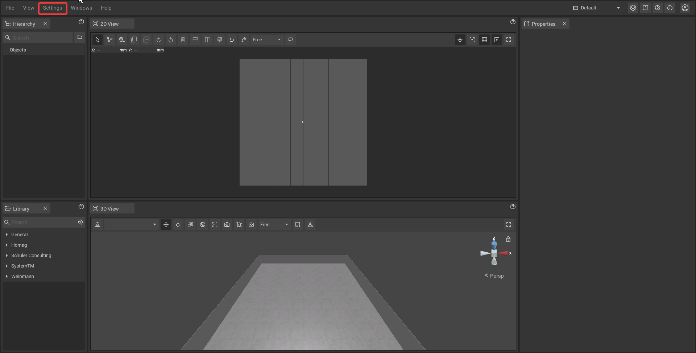
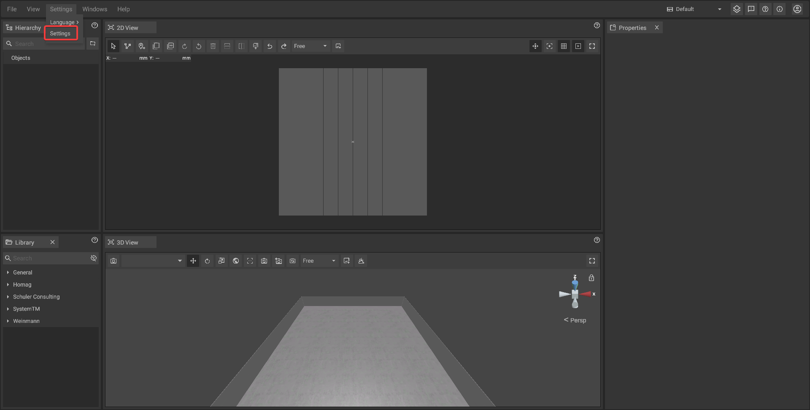
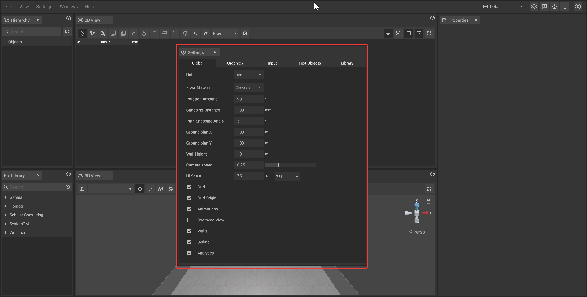

# Settings Panel

The settings panel offers a variety of options to customize iVP. It is divided into three tabs:

* [Global settings:](./settings/global-settings.md) user interface scale, globally used unit, floor plan settings, etc.
* [Graphic settings:](./settings/graphic-settings-panel.md) resolution, frame rate, graphical quality level, etc.
* [Input manager:](./settings/input-manager.md) keyboard shortcuts

* [Text objects settings:](./settings/text-objects-settings.md) show objects,text constrains, set objects orientation, let objects look to the camera

* [Library settings:](./settings/library-settings.md) library settings

## Opening the settings panel step by step:

The settings panel can be opened by either clicking on **Settings -> Settings**.

The open settings panel:

