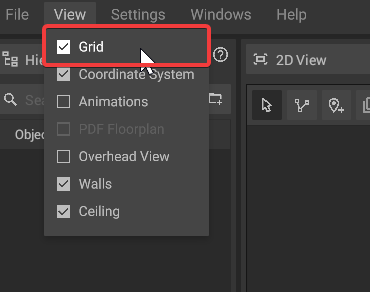

# Grid

The grid is an overlay in the [2D View](the-2d-view.md) that makes it easier to estimate distances, e.g. when placing objects.

## Grid visibility:

The grid can be switched on or off at any time by clicking on **View -> Grid**.

## Grid origin:

The grid originates from the same point as the [coordinate system](coordinate-system.md). Therefore, a [change of the reference point](coordinate-system.md#adjusting-the-reference-point) will also change the grid origin.